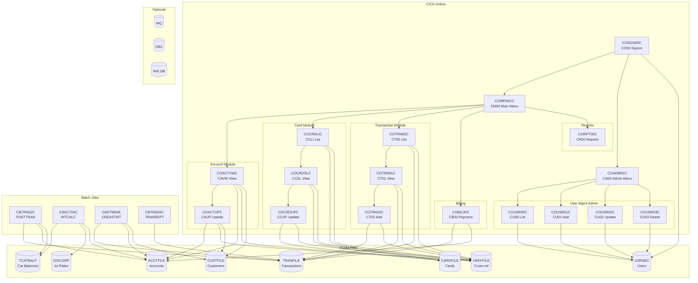
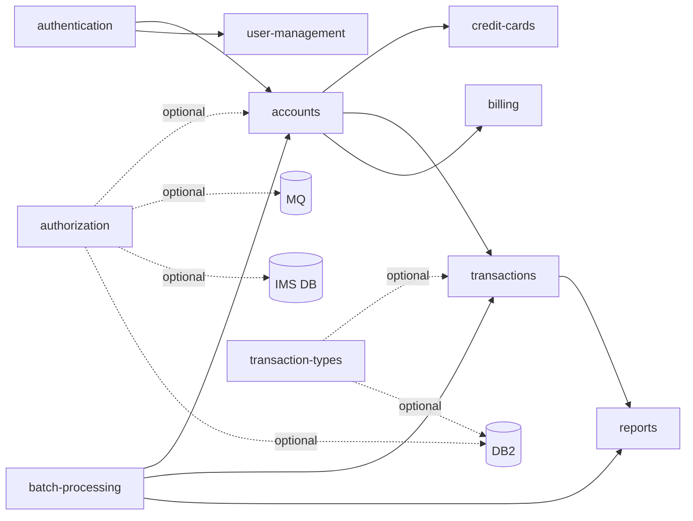

# System CardDemo - Overview for User Stories

**Version:** 2026-03-26  
**Purpose:** Single source of truth for creating well-structured User Stories based on the CardDemo mainframe credit card management application.

---

## 📊 Platform Statistics

- **Technology Stack:** COBOL, CICS, VSAM, JCL, RACF, Assembler (optional: DB2, IMS DB, MQ)
- **Architecture Pattern:** Mainframe OLTP (CICS online) + Batch (JCL), VSAM file-based persistence
- **Key Capabilities:** Account management, credit card management, transaction processing, billing, reporting, user administration
- **User Roles:** Regular Users (card management), Admin Users (system administration)
- **Optional Extensions:** Credit Card Authorizations (IMS/DB2/MQ), Transaction Type Management (DB2), Account Extraction (MQ/VSAM)

---

## 🏗️ High-Level Architecture

### Technology Stack

**Online (CICS):** COBOL programs invoked as CICS transactions via BMS maps (3270 terminal interface)  
**Batch:** COBOL programs executed via JCL jobs on z/OS  
**Data Storage:** VSAM KSDS files (with Alternate Indexes) for all master data  
**Security:** RACF for authentication; user security data stored in VSAM USRSEC file  
**Optional DB:** DB2 for transaction types and authorization audit logs  
**Optional Messaging:** MQ for async authorization and account inquiry requests  
**Optional Hierarchical DB:** IMS DB for customer/authorization data  
**Utility Programs:** Assembler routines (MVSWAIT timer, COBDATFT date conversion)

### Architectural Patterns

- **Screen/Program separation:** Each CICS transaction has a BMS map (screen definition) and a COBOL program
- **Communication Area (COMMAREA):** `CARDDEMO-COMMAREA` (COCOM01Y copybook) passes session state between transactions
- **VSAM KSDS with AIX:** All master files use keyed-sequential access with alternate index support
- **Copybook-based data contracts:** Shared data structures defined in `.cpy` copybooks (CVACT01Y, CVCUS01Y, CVTRA05Y, etc.)
- **Batch/Online integration:** Batch jobs read/update the same VSAM files used online; CICS files must be closed before batch runs
- **Role-based navigation:** Admin vs. Regular user type stored in COMMAREA determines menu flow

### VSAM File Inventory

| VSAM File   | Primary Key         | Content              | Alternate Index   |
|-------------|---------------------|----------------------|-------------------|
| ACCTFILE    | ACCT-ID (9(11))     | Account master       | ACCT-CARD-NUM     |
| CARDFILE    | CARD-NUM (X(16))    | Card master          | CARD-ACCT-ID      |
| CUSTFILE    | CUST-ID (9(09))     | Customer master      | CUST-SSN          |
| TRANFILE    | TRAN-ID (X(16))     | Transaction master   | TRAN-CARD-NUM     |
| XREFFILE    | XREF-CARD-NUM       | Card-Acct-Cust xref  | XREF-ACCT-ID      |
| TCATBALF    | TRAN-CAT-KEY        | Transaction cat bal  | —                 |
| DISCGRP     | DIS-GROUP-KEY       | Interest rate groups | —                 |
| USRSEC      | SEC-USR-ID (X(08))  | User security data   | —                 |

---

## 📚 Module Catalog

<!-- MODULE_LIST_START -->
**Modules:** authentication, accounts, credit-cards, transactions, billing, reports, user-management, batch-processing, authorization, transaction-types
<!-- MODULE_LIST_END -->

---

### 1. Authentication

**ID:** `authentication`  
**Purpose:** User signon and session initialization for the CardDemo application  
**Key Components:**
- `COSGN00C.cbl` — CICS program; validates user ID + password against USRSEC VSAM file
- `COSGN00.bms` — BMS map for signon screen
- `CSUSR01Y.cpy` — SEC-USER-DATA structure (user ID, names, password, type)
- `COCOM01Y.cpy` — CARDDEMO-COMMAREA shared communication area

**CICS Transaction:** `CC00`  
**Screen:** COSGN00 (Signon Screen)

**Processing Flow:**
1. User enters User ID + Password on signon screen
2. COSGN00C reads USRSEC VSAM file to validate credentials
3. On success, sets `CDEMO-USER-ID` and `CDEMO-USER-TYPE` (A=Admin, U=User) in COMMAREA
4. Routes to Main Menu (CM00/COMEN01C) or Admin Menu (CA00/COADM01C)

**Data Model:**
```
SEC-USER-DATA (USRSEC file, RECLN=80):
  SEC-USR-ID      PIC X(08)   -- User ID (primary key)
  SEC-USR-FNAME   PIC X(20)   -- First name
  SEC-USR-LNAME   PIC X(20)   -- Last name
  SEC-USR-PWD     PIC X(08)   -- Password
  SEC-USR-TYPE    PIC X(01)   -- 'A'=Admin, 'U'=User
```

**Business Rules:**
- Invalid user ID or password → display error message, remain on signon screen
- PF3 key → display thank-you message and exit
- Any other key → display invalid key message
- Session context (user type) propagated to all subsequent transactions via COMMAREA

**User Story Examples:**
- As a cardholder, I want to sign in with my user ID and password so I can access my account
- As an administrator, I want to log in with admin credentials so I can manage users

---

### 2. Accounts

**ID:** `accounts`  
**Purpose:** View and update credit card account details; interest calculation (batch)  
**Key Components:**
- `COACTVWC.cbl` — CICS program; display account details (CAVW / COACTVW)
- `COACTUPC.cbl` — CICS program; update account information (CAUP / COACTUP)
- `CBACT01C.cbl` — Batch: account data validation/processing
- `CBACT02C.cbl` — Batch: account copy/report operations
- `CBACT03C.cbl` — Batch: account extract processing
- `CBACT04C.cbl` — Batch: interest calculation (INTCALC job)
- `CVACT01Y.cpy` — ACCOUNT-RECORD data structure
- `CVACT02Y.cpy` — CARD-RECORD data structure
- `CVACT03Y.cpy` — CARD-XREF-RECORD data structure

**CICS Transactions:**
- `CAVW` → Account View (read-only)
- `CAUP` → Account Update (editable)

**Data Model:**
```
ACCOUNT-RECORD (ACCTFILE, RECLN=300):
  ACCT-ID                 PIC 9(11)        -- Primary key
  ACCT-ACTIVE-STATUS      PIC X(01)        -- 'Y'=Active, 'N'=Inactive
  ACCT-CURR-BAL           PIC S9(10)V99    -- Current balance
  ACCT-CREDIT-LIMIT       PIC S9(10)V99    -- Credit limit
  ACCT-CASH-CREDIT-LIMIT  PIC S9(10)V99    -- Cash credit limit
  ACCT-OPEN-DATE          PIC X(10)        -- YYYY-MM-DD
  ACCT-EXPIRAION-DATE     PIC X(10)        -- YYYY-MM-DD
  ACCT-REISSUE-DATE       PIC X(10)        -- YYYY-MM-DD
  ACCT-CURR-CYC-CREDIT    PIC S9(10)V99    -- Current cycle credits
  ACCT-CURR-CYC-DEBIT     PIC S9(10)V99    -- Current cycle debits
  ACCT-ADDR-ZIP           PIC X(10)        -- ZIP code
  ACCT-GROUP-ID           PIC X(10)        -- Disclosure group ID

CARD-XREF-RECORD (XREFFILE, RECLN=50):
  XREF-CARD-NUM           PIC X(16)        -- Card number (primary key)
  XREF-CUST-ID            PIC 9(09)        -- Customer ID
  XREF-ACCT-ID            PIC 9(11)        -- Account ID
```

**Business Rules:**
- Account can be looked up by Card Number (via XREFFILE AIX) or Account ID
- Interest calculation (CBACT04C) reads TCATBALF and DISCGRP to compute per-group interest
- Account status must be 'Y' (Active) for most transactions to proceed
- Credit limit enforced during transaction add (prevents over-limit)
- Batch interest job (INTCALC) updates ACCT-CURR-BAL with computed interest

**User Story Examples:**
- As a cardholder, I want to view my account balance and credit limit so I know my available credit
- As a cardholder, I want to update my ZIP code so my billing address is current
- As a system, I want to calculate monthly interest so balances are updated at cycle end

---

### 3. Credit Cards

**ID:** `credit-cards`  
**Purpose:** List, view, and update credit card information linked to an account  
**Key Components:**
- `COCRDLIC.cbl` — CICS program; list cards for an account (CCLI / COCRDLI)
- `COCRDSLC.cbl` — CICS program; view credit card details (CCDL / COCRDSL)
- `COCRDUPC.cbl` — CICS program; update credit card record (CCUP / COCRDUP)
- `CVCRD01Y.cpy` — CC-WORK-AREAS (card navigation work area)
- `CVACT02Y.cpy` — CARD-RECORD data structure

**CICS Transactions:**
- `CCLI` → Credit Card List
- `CCDL` → Credit Card View/Detail
- `CCUP` → Credit Card Update

**Data Model:**
```
CARD-RECORD (CARDFILE, RECLN=150):
  CARD-NUM              PIC X(16)    -- Card number (primary key)
  CARD-ACCT-ID          PIC 9(11)    -- Linked account ID
  CARD-CVV-CD           PIC 9(03)    -- CVV security code
  CARD-EMBOSSED-NAME    PIC X(50)    -- Name on card
  CARD-EXPIRAION-DATE   PIC X(10)    -- Expiry date YYYY-MM-DD
  CARD-ACTIVE-STATUS    PIC X(01)    -- 'Y'=Active, 'N'=Inactive
```

**Business Rules:**
- Card list filtered by Account ID stored in COMMAREA
- Card number is 16-digit, must match XREFFILE for valid card-account-customer linkage
- Card status can be toggled Active/Inactive via update screen
- Embossed name may differ from customer legal name
- CVV stored in plain text (design characteristic for demo environment)

**User Story Examples:**
- As a cardholder, I want to see all cards on my account so I know which are active
- As a cardholder, I want to view my card's expiration date so I can plan for renewal
- As a cardholder, I want to deactivate a lost card so unauthorized charges are prevented

---

### 4. Transactions

**ID:** `transactions`  
**Purpose:** List, view, add, and batch-process credit card transactions  
**Key Components:**
- `COTRN00C.cbl` — CICS program; transaction list (CT00 / COTRN00)
- `COTRN01C.cbl` — CICS program; transaction view/detail (CT01 / COTRN01)
- `COTRN02C.cbl` — CICS program; add new transaction (CT02 / COTRN02)
- `CBTRN01C.cbl` — Batch: transaction file processing/validation
- `CBTRN02C.cbl` — Batch: transaction posting (POSTTRAN job)
- `CBTRN03C.cbl` — Batch: transaction report generation (TRANREPT job, submitted from CICS)
- `CVTRA05Y.cpy` — TRAN-RECORD data structure
- `CVTRA01Y.cpy` — TRAN-CAT-BAL-RECORD structure
- `CVTRA02Y.cpy` — DIS-GROUP-RECORD structure

**CICS Transactions:**
- `CT00` → Transaction List (paginated)
- `CT01` → Transaction View (detail)
- `CT02` → Transaction Add

**Data Model:**
```
TRAN-RECORD (TRANFILE, RECLN=350):
  TRAN-ID               PIC X(16)        -- Transaction ID (primary key)
  TRAN-TYPE-CD          PIC X(02)        -- Transaction type code
  TRAN-CAT-CD           PIC 9(04)        -- Transaction category code
  TRAN-SOURCE           PIC X(10)        -- Source system/channel
  TRAN-DESC             PIC X(100)       -- Description
  TRAN-AMT              PIC S9(09)V99    -- Amount (signed)
  TRAN-MERCHANT-ID      PIC 9(09)        -- Merchant ID
  TRAN-MERCHANT-NAME    PIC X(50)        -- Merchant name
  TRAN-MERCHANT-CITY    PIC X(50)        -- Merchant city
  TRAN-MERCHANT-ZIP     PIC X(10)        -- Merchant ZIP
  TRAN-CARD-NUM         PIC X(16)        -- Associated card number (AIX key)
  TRAN-ORIG-TS          PIC X(26)        -- Original timestamp
  TRAN-PROC-TS          PIC X(26)        -- Processing timestamp

TRAN-CAT-BAL-RECORD (TCATBALF, RECLN=50):
  TRANCAT-ACCT-ID       PIC 9(11)        -- Account ID (part of key)
  TRANCAT-TYPE-CD       PIC X(02)        -- Type code (part of key)
  TRANCAT-CD            PIC 9(04)        -- Category code (part of key)
  TRAN-CAT-BAL          PIC S9(09)V99    -- Category balance
```

**Business Rules:**
- Transactions listed by Card Number (via TRANFILE AIX on TRAN-CARD-NUM)
- POSTTRAN batch job (CBTRN02C) posts pending transactions and updates account balances
- Transaction category balance (TCATBALF) updated during posting for interest calculation
- Transaction report (TRANREPT) can be submitted from online (CORPT00C) or run as standalone batch
- Amount sign: negative = debit/charge, positive = credit/payment
- Transaction ID is system-generated 16-character unique key
- Transaction type codes and category codes define interest rate group via DISCGRP file

**User Story Examples:**
- As a cardholder, I want to view my recent transactions so I can monitor spending
- As a cardholder, I want to see transaction details including merchant name so I can verify charges
- As a cardholder, I want to add a transaction manually so I can record a purchase
- As a system, I want to post batch transactions so account balances stay current

---

### 5. Billing

**ID:** `billing`  
**Purpose:** Process bill payments for a credit card account  
**Key Components:**
- `COBIL00C.cbl` — CICS program; bill payment processing (CB00 / COBIL00)
- `COBIL00.bms` — BMS map for bill payment screen

**CICS Transaction:** `CB00` → Bill Payment

**Processing Flow:**
1. User selects account for payment
2. Enters payment amount
3. COBIL00C validates amount and account status
4. Creates a credit transaction record (TRANFILE)
5. Updates account current balance (ACCTFILE)

**Business Rules:**
- Payment amount must be positive
- Payment creates a positive (credit) transaction entry
- Account must exist and be active to accept payment
- Current balance reduced by payment amount
- Payment reflected in current cycle credit balance (ACCT-CURR-CYC-CREDIT)

**User Story Examples:**
- As a cardholder, I want to make a bill payment so my outstanding balance is reduced
- As a cardholder, I want to see my current balance before paying so I know what I owe
- As a system, I want to record payment transactions so the audit trail is complete

---

### 6. Reports

**ID:** `reports`  
**Purpose:** Generate and display transaction reports and account statements  
**Key Components:**
- `CORPT00C.cbl` — CICS program; report request/submit screen (CR00 / CORPT00)
- `CBSTM03A.CBL` — Batch: statement generation (CREASTMT job)
- `CBSTM03B.CBL` — Batch: statement detail processing
- `CBTRN03C.cbl` — Batch: daily transaction report (TRANREPT job)
- `CVTRA07Y.cpy` — Report data structures (REPORT-NAME-HEADER, TRANSACTION-DETAIL-REPORT)

**CICS Transaction:** `CR00` → Transaction Reports

**Report Types:**
- **Daily Transaction Report (DALYREPT):** Summarizes transactions by account, type, and category within a date range; includes page totals, account totals, and grand total
- **Account Statement (CREASTMT):** Full statement with transaction detail and totals per account

**Report Output Structure:**
```
TRANSACTION-DETAIL-REPORT line fields:
  TRAN-REPORT-TRANS-ID    16 chars   -- Transaction ID
  TRAN-REPORT-ACCOUNT-ID  11 chars   -- Account ID
  TRAN-REPORT-TYPE-CD     2 chars    -- Type code
  TRAN-REPORT-TYPE-DESC   15 chars   -- Type description
  TRAN-REPORT-CAT-CD      4 digits   -- Category code
  TRAN-REPORT-CAT-DESC    29 chars   -- Category description
  TRAN-REPORT-SOURCE      10 chars   -- Source
  TRAN-REPORT-AMT         formatted  -- Amount with sign
```

**Business Rules:**
- Reports require start and end date input (YYYY-MM-DD format)
- TRANREPT can be submitted from CICS (CORPT00C) or run as standalone JCL batch
- Statement job (CREASTMT) processes all accounts sequentially
- Report output written to SYSOUT (print) or GDG dataset

**User Story Examples:**
- As a cardholder, I want to generate a transaction report for a date range so I can review spending
- As an administrator, I want to run monthly statements so all customers receive billing summaries
- As an auditor, I want daily transaction reports so I can reconcile posted amounts

---

### 7. User Management

**ID:** `user-management`  
**Purpose:** Administrative management of system users (list, add, update, delete)  
**Key Components:**
- `COADM01C.cbl` — CICS program; Admin Menu (CA00 / COADM01)
- `COUSR00C.cbl` — CICS program; list users (CU00 / COUSR00)
- `COUSR01C.cbl` — CICS program; add user (CU01 / COUSR01)
- `COUSR02C.cbl` — CICS program; update user (CU02 / COUSR02)
- `COUSR03C.cbl` — CICS program; delete user (CU03 / COUSR03)
- `CSUSR01Y.cpy` — SEC-USER-DATA structure
- `CSMEN01.bms` — Main menu BMS map
- `COADM01.bms` — Admin menu BMS map

**CICS Transactions:**
- `CA00` → Admin Menu
- `CU00` → List Users
- `CU01` → Add User
- `CU02` → Update User
- `CU03` → Delete User

**Data Model:**
```
SEC-USER-DATA (USRSEC VSAM file, RECLN=80):
  SEC-USR-ID      PIC X(08)   -- User ID (primary key, 8 chars)
  SEC-USR-FNAME   PIC X(20)   -- First name
  SEC-USR-LNAME   PIC X(20)   -- Last name
  SEC-USR-PWD     PIC X(08)   -- Password (8 chars, plain text)
  SEC-USR-TYPE    PIC X(01)   -- 'A'=Admin, 'U'=Regular User
```

**Business Rules:**
- Only Admin users can access user management (CDEMO-USRTYP-ADMIN check in COMMAREA)
- User ID must be unique in USRSEC file
- User type determines available menu options (Admin Menu vs Main Menu)
- Delete requires confirmation step
- Password stored as plain text in USRSEC (characteristic of mainframe demo design)
- Initial user security file loaded via DUSRSECJ batch job (IEBGENER)

**User Story Examples:**
- As an administrator, I want to view all system users so I can audit access
- As an administrator, I want to add a new user so they can access the system
- As an administrator, I want to update a user's type so their permissions are correct
- As an administrator, I want to delete an inactive user so unauthorized access is prevented

---

### 8. Batch Processing

**ID:** `batch-processing`  
**Purpose:** Backend batch jobs for account maintenance, transaction posting, interest calculation, and data management  
**Key Components:**
- `CBACT01C.cbl` — Account data processing batch
- `CBACT02C.cbl` — Account copy/extract batch
- `CBACT03C.cbl` — Account extract processing
- `CBACT04C.cbl` — Interest calculation (INTCALC job)
- `CBCUS01C.cbl` — Customer file processing batch
- `CBTRN01C.cbl` — Transaction validation batch
- `CBTRN02C.cbl` — Transaction posting (POSTTRAN)
- `CBTRN03C.cbl` — Transaction report (TRANREPT)
- `CBSTM03A.CBL` / `CBSTM03B.CBL` — Statement generation (CREASTMT)
- `CBIMPORT.cbl` / `CBEXPORT.cbl` — Import/export utilities
- `COBSWAIT.cbl` — Assembler-based wait utility (WAITSTEP job)
- `CSUTLDTC.cbl` — Date utility subroutine

**Key JCL Jobs:**
| Job       | Program   | Function                              |
|-----------|-----------|---------------------------------------|
| POSTTRAN  | CBTRN02C  | Post transactions, update balances    |
| INTCALC   | CBACT04C  | Calculate and apply interest          |
| CREASTMT  | CBSTM03A  | Generate account statements           |
| TRANREPT  | CBTRN03C  | Generate daily transaction report     |
| COMBTRAN  | SORT      | Combine transaction files             |

**VSAM File Refresh Jobs:**
- ACCTFILE, CARDFILE, CUSTFILE, TRANFILE — refresh from source data
- TCATBALF — refresh transaction category balances
- DISCGRP — load interest rate disclosure groups
- XREFFILE — define account-card-customer cross reference

**Business Rules:**
- CICS files must be closed (CLOSEFIL job) before running most batch jobs that update them
- OPENFIL job reopens CICS files after batch completion
- Interest calculation reads TCATBALF (category balances) and DISCGRP (interest rates) to compute per-account interest
- Transaction posting (POSTTRAN) updates ACCT-CURR-BAL and TRAN-CAT-BAL-RECORD
- GDG (Generation Data Groups) used for versioned report output
- COBSWAIT (WAITSTEP) provides configurable delay between batch steps

**User Story Examples:**
- As a system operator, I want to run nightly transaction posting so balances are updated each day
- As a system operator, I want to run monthly interest calculation so statements reflect accrued interest
- As a system operator, I want to refresh master files so test data is reset to a known state
- As a system, I want to close CICS files before batch runs so data integrity is maintained

---

### 9. Authorization (Optional — IMS/DB2/MQ)

**ID:** `authorization`  
**Purpose:** Credit card authorization processing using IMS, DB2, and MQ integration  
**Location:** `app/app-authorization-ims-db2-mq/`  
**Key Components:**
- `COPAUS0C.cbl` — CICS; Pending Authorization Summary (CPVS / COPAU00)
- `COPAUS1C.cbl` — CICS; Pending Authorization Details (CPVD / COPAU01)
- `COPAUA0C.cbl` — CICS; Process Authorization Requests via MQ (CP00)
- `CBPAUP0C.cbl` — Batch; Purge Expired Authorizations (CBPAUP0J)

**CICS Transactions:**
- `CPVS` → Pending Authorization Summary (reads IMS and VSAM)
- `CPVD` → Pending Authorization Details (updates IMS, inserts DB2)
- `CP00` → Authorization processor (MQ trigger, request/response, IMS insert/update)

**Integration Points:**
- **MQ:** Receives authorization requests via trigger; sends responses
- **IMS DB:** Stores authorization records; supports segment reads and updates
- **DB2:** Logs authorization audit records with SQL inserts
- **VSAM:** Cross-references card/account data

**Business Rules:**
- Authorization requests arrive via MQ trigger (CP00 transaction)
- Pending authorizations viewable in summary (CPVS) and detail (CPVD) screens
- Detail screen updates IMS record and inserts DB2 audit row
- Expired authorizations purged via CBPAUP0J batch job
- This module requires IMS, DB2, and MQ to be configured

**User Story Examples:**
- As a cardholder, I want to view pending authorizations so I can see charges not yet posted
- As an authorization system, I want to process incoming requests via MQ so authorizations are handled asynchronously
- As a system operator, I want to purge expired authorizations so the IMS database stays clean

---

### 10. Transaction Types (Optional — DB2)

**ID:** `transaction-types`  
**Purpose:** Maintain and manage transaction type reference data using DB2  
**Location:** `app/app-transaction-type-db2/`  
**Key Components:**
- `COTRTUPC.cbl` — CICS; Transaction Type add/edit (CTTU / COTRTUP)
- `COTRTLIC.cbl` — CICS; Transaction Type list/update/delete (CTLI / COTRTLI)
- `COBTUPDT.cbl` — Batch; Maintain transaction type table (MNTTRDB2)

**CICS Transactions:**
- `CTTU` → Transaction Type add/edit (DB2 UPDATE and INSERT)
- `CTLI` → Transaction Type list/update/delete (DB2 cursor and DELETE)

**Integration Points:**
- **DB2:** All transaction type data stored in DB2 tables (not VSAM)
- **JCL:** CREADB21 creates DB2 database and loads tables; TRANEXTR extracts latest DB2 data

**Business Rules:**
- Only accessible from Admin Menu (CA00) — Admin users only
- DB2 cursor used for list/paginated browse of transaction types
- Transaction types used in TRANFILE records (TRAN-TYPE-CD field)
- MNTTRDB2 batch job synchronizes DB2 data
- TRANEXTR extracts transaction type data for reporting

**User Story Examples:**
- As an administrator, I want to view all transaction type codes so I can understand the classification scheme
- As an administrator, I want to add a new transaction type so new purchase categories can be tracked
- As an administrator, I want to delete an obsolete transaction type so the reference data stays current

---

## 🔄 Architecture Diagram



### Module Dependency Diagram



---

## 📊 Data Models

### Account (ACCTFILE)
```cobol
01  ACCOUNT-RECORD.
    05  ACCT-ID                   PIC 9(11)       -- Primary key
    05  ACCT-ACTIVE-STATUS        PIC X(01)       -- Y/N
    05  ACCT-CURR-BAL             PIC S9(10)V99   -- Current balance
    05  ACCT-CREDIT-LIMIT         PIC S9(10)V99   -- Credit limit
    05  ACCT-CASH-CREDIT-LIMIT    PIC S9(10)V99
    05  ACCT-OPEN-DATE            PIC X(10)       -- YYYY-MM-DD
    05  ACCT-EXPIRAION-DATE       PIC X(10)
    05  ACCT-REISSUE-DATE         PIC X(10)
    05  ACCT-CURR-CYC-CREDIT      PIC S9(10)V99
    05  ACCT-CURR-CYC-DEBIT       PIC S9(10)V99
    05  ACCT-ADDR-ZIP             PIC X(10)
    05  ACCT-GROUP-ID             PIC X(10)       -- Links to DISCGRP
```

### Customer (CUSTFILE)
```cobol
01  CUSTOMER-RECORD.
    05  CUST-ID                   PIC 9(09)       -- Primary key
    05  CUST-FIRST-NAME           PIC X(25)
    05  CUST-MIDDLE-NAME          PIC X(25)
    05  CUST-LAST-NAME            PIC X(25)
    05  CUST-ADDR-LINE-1          PIC X(50)
    05  CUST-ADDR-LINE-2          PIC X(50)
    05  CUST-ADDR-LINE-3          PIC X(50)
    05  CUST-ADDR-STATE-CD        PIC X(02)
    05  CUST-ADDR-COUNTRY-CD      PIC X(03)
    05  CUST-ADDR-ZIP             PIC X(10)
    05  CUST-PHONE-NUM-1          PIC X(15)
    05  CUST-PHONE-NUM-2          PIC X(15)
    05  CUST-SSN                  PIC 9(09)
    05  CUST-GOVT-ISSUED-ID       PIC X(20)
    05  CUST-DOB-YYYY-MM-DD       PIC X(10)
    05  CUST-EFT-ACCOUNT-ID       PIC X(10)
    05  CUST-PRI-CARD-HOLDER-IND  PIC X(01)       -- Primary card holder Y/N
    05  CUST-FICO-CREDIT-SCORE    PIC 9(03)       -- FICO score 0-850
```

### Credit Card (CARDFILE)
```cobol
01  CARD-RECORD.
    05  CARD-NUM              PIC X(16)    -- Primary key (16-digit PAN)
    05  CARD-ACCT-ID          PIC 9(11)    -- Foreign key to ACCTFILE
    05  CARD-CVV-CD           PIC 9(03)
    05  CARD-EMBOSSED-NAME    PIC X(50)
    05  CARD-EXPIRAION-DATE   PIC X(10)    -- YYYY-MM-DD
    05  CARD-ACTIVE-STATUS    PIC X(01)    -- Y/N
```

### Transaction (TRANFILE)
```cobol
01  TRAN-RECORD.
    05  TRAN-ID               PIC X(16)        -- Primary key
    05  TRAN-TYPE-CD          PIC X(02)        -- Type code
    05  TRAN-CAT-CD           PIC 9(04)        -- Category code
    05  TRAN-SOURCE           PIC X(10)        -- Source system
    05  TRAN-DESC             PIC X(100)       -- Description
    05  TRAN-AMT              PIC S9(09)V99    -- Amount (signed)
    05  TRAN-MERCHANT-ID      PIC 9(09)
    05  TRAN-MERCHANT-NAME    PIC X(50)
    05  TRAN-MERCHANT-CITY    PIC X(50)
    05  TRAN-MERCHANT-ZIP     PIC X(10)
    05  TRAN-CARD-NUM         PIC X(16)        -- AIX key
    05  TRAN-ORIG-TS          PIC X(26)        -- Original timestamp
    05  TRAN-PROC-TS          PIC X(26)        -- Processing timestamp
```

### User Security (USRSEC)
```cobol
01 SEC-USER-DATA.
    05 SEC-USR-ID       PIC X(08)    -- Primary key
    05 SEC-USR-FNAME    PIC X(20)
    05 SEC-USR-LNAME    PIC X(20)
    05 SEC-USR-PWD      PIC X(08)    -- Plain text (demo only)
    05 SEC-USR-TYPE     PIC X(01)    -- A=Admin, U=User
```

### COMMAREA (Inter-program communication)
```cobol
01 CARDDEMO-COMMAREA.
    05 CDEMO-FROM-TRANID        PIC X(04)    -- Source transaction
    05 CDEMO-FROM-PROGRAM       PIC X(08)    -- Source program
    05 CDEMO-TO-TRANID          PIC X(04)    -- Target transaction
    05 CDEMO-TO-PROGRAM         PIC X(08)    -- Target program
    05 CDEMO-USER-ID            PIC X(08)    -- Current user
    05 CDEMO-USER-TYPE          PIC X(01)    -- A=Admin, U=User
    05 CDEMO-PGM-CONTEXT        PIC 9(01)    -- 0=Enter, 1=Re-enter
    05 CDEMO-CUST-ID            PIC 9(09)    -- Current customer
    05 CDEMO-ACCT-ID            PIC 9(11)    -- Current account
    05 CDEMO-ACCT-STATUS        PIC X(01)    -- Account status
    05 CDEMO-CARD-NUM           PIC 9(16)    -- Current card
    05 CDEMO-LAST-MAP           PIC X(7)     -- Navigation state
    05 CDEMO-LAST-MAPSET        PIC X(7)
```

---

## 📋 Business Rules by Module

### Authentication — Rules
- User ID must exist in USRSEC VSAM file
- Password must match stored value exactly (case-sensitive, 8 chars)
- User type ('A' or 'U') loaded from USRSEC and propagated via COMMAREA to all screens
- ENTER key submits signon; PF3 exits application; other keys produce invalid-key message

### Accounts — Rules
- Account lookup can use Card Number (via XREFFILE) or Account ID
- ACCT-ACTIVE-STATUS = 'Y' required for transactions and payments
- ACCT-GROUP-ID links to DISCGRP for interest rate disclosure
- Interest calculated as: balance × (interest rate from DISCGRP for group/type/category)

### Credit Cards — Rules
- Each card linked to exactly one account via CARD-ACCT-ID
- XREFFILE maintains 3-way link: Card ↔ Account ↔ Customer
- CARD-ACTIVE-STATUS can be set to 'N' to deactivate without deleting
- 16-digit card number (PAN) is the primary key

### Transactions — Rules
- Transactions linked to card via TRAN-CARD-NUM (AIX on TRANFILE)
- Negative amounts = charges/debits; positive = credits/payments
- POSTTRAN job must run daily to update account balances
- Category balance (TCATBALF) keyed by Account + Type + Category for interest calculation
- Transaction type code + category code determine applicable interest rate group

### Billing — Rules
- Payment amount must be > 0
- Payment adds positive transaction; reduces current balance
- Minimum payment not enforced in base application (demo simplification)

### User Management — Rules
- Admin-only module (CDEMO-USER-TYPE = 'A' required)
- User IDs are unique 8-character alphanumeric strings
- Delete is hard delete from USRSEC file (no soft delete)
- Initial user file populated via DUSRSECJ JCL job

### Batch Processing — Rules
- CLOSEFIL must precede batch jobs that update VSAM files used by CICS
- OPENFIL must follow batch completion to restore CICS access
- GDG datasets retain previous generations for audit trail
- WAITSTEP (COBSWAIT) can be configured for time delays between steps

---

## 🌐 CICS Transaction Interface Summary

This application uses CICS 3270 terminal interface (no REST/HTTP APIs). The "interface" is transaction ID + BMS screen input.

### Navigation Key Map (standard across all screens)
| Key  | Action                         |
|------|--------------------------------|
| ENTER | Submit / Process screen input |
| PF3  | Return to previous / Exit     |
| PF7  | Scroll up (list screens)      |
| PF8  | Scroll down (list screens)    |
| CLEAR | Clear screen / Cancel         |

### Transaction Catalog
| Transaction | Program    | Screen    | Module         |
|-------------|------------|-----------|----------------|
| CC00        | COSGN00C   | COSGN00   | authentication |
| CM00        | COMEN01C   | COMEN01   | accounts       |
| CAVW        | COACTVWC   | COACTVW   | accounts       |
| CAUP        | COACTUPC   | COACTUP   | accounts       |
| CCLI        | COCRDLIC   | COCRDLI   | credit-cards   |
| CCDL        | COCRDSLC   | COCRDSL   | credit-cards   |
| CCUP        | COCRDUPC   | COCRDUP   | credit-cards   |
| CT00        | COTRN00C   | COTRN00   | transactions   |
| CT01        | COTRN01C   | COTRN01   | transactions   |
| CT02        | COTRN02C   | COTRN02   | transactions   |
| CR00        | CORPT00C   | CORPT00   | reports        |
| CB00        | COBIL00C   | COBIL00   | billing        |
| CA00        | COADM01C   | COADM01   | user-management|
| CU00        | COUSR00C   | COUSR00   | user-management|
| CU01        | COUSR01C   | COUSR01   | user-management|
| CU02        | COUSR02C   | COUSR02   | user-management|
| CU03        | COUSR03C   | COUSR03   | user-management|
| CPVS        | COPAUS0C   | COPAU00   | authorization  |
| CPVD        | COPAUS1C   | COPAU01   | authorization  |
| CP00        | COPAUA0C   | —         | authorization  |
| CTTU        | COTRTUPC   | COTRTUP   | transaction-types|
| CTLI        | COTRTLIC   | COTRTLI   | transaction-types|
| CDRD        | CODATE01   | —         | authorization  |
| CDRA        | COACCT01   | —         | authorization  |

---

## 🎯 Patterns for User Stories

### Templates by Domain

#### Account Management Stories
**Pattern:** As a [cardholder/admin], I want to [view/update] [account data] so that [financial visibility/accuracy]
- As a cardholder, I want to view my current balance so I know my available credit
- As a cardholder, I want to update my billing ZIP so my address is current
- As a system, I want to calculate monthly interest so balances reflect accrued charges

#### Card Management Stories
**Pattern:** As a cardholder, I want to [manage] my card so that [security/usability]
- As a cardholder, I want to view all cards on my account so I know which are active
- As a cardholder, I want to deactivate a lost card so unauthorized charges are prevented

#### Transaction Stories
**Pattern:** As a cardholder, I want to [view/add] transactions so that [spending visibility/record keeping]
- As a cardholder, I want to view recent transactions so I can monitor for fraud
- As a cardholder, I want to add a manual transaction so I have a complete record

#### Billing Stories
**Pattern:** As a cardholder, I want to pay my bill so that [balance reduction/good standing]
- As a cardholder, I want to make a payment so my balance is reduced

#### Admin/User Management Stories
**Pattern:** As an administrator, I want to [manage users] so that [access control/security]
- As an administrator, I want to list all users so I can audit system access
- As an administrator, I want to delete an inactive user so the system stays secure

#### Batch/Operations Stories
**Pattern:** As a system operator, I want to run [batch job] so that [data is current/consistent]
- As an operator, I want to run nightly transaction posting so balances are updated daily
- As an operator, I want to generate monthly statements so customers receive billing information

### Story Complexity Guidelines
- **Simple (1-2 pts):** Screen navigation, display-only changes, single VSAM read
- **Medium (3-5 pts):** CRUD with validation, multi-file reads (XREF + ACCT + CARD), screen flow changes
- **Complex (5-8 pts):** Batch job changes, multi-file updates, optional module integration (IMS/DB2/MQ), new VSAM file definitions

### Acceptance Criteria Patterns
- **Authentication:** System validates user ID + password match USRSEC; invalid credentials display error message; valid login routes to correct menu by user type
- **Account View:** Displays current balance, credit limit, and active status from ACCTFILE; shows customer name from CUSTFILE via XREFFILE
- **Transaction List:** Displays transactions for current card in reverse chronological order; PF7/PF8 enables pagination
- **Payment:** Amount must be positive; creates transaction record; updates account balance; confirms success to user
- **User Add:** User ID must be unique; type must be 'A' or 'U'; all required fields present before write to USRSEC
- **Batch Completion:** Job completes with return code 0; VSAM record counts match expected; balances reconcile to prior totals plus/minus transactions

---

## ⚡ Performance Budgets

- **CICS Transaction Response:** < 2 seconds (3270 screen refresh)
- **VSAM Read (KSDS primary key):** < 10ms (indexed direct access)
- **VSAM Read (AIX):** < 20ms (alternate index lookup)
- **Batch Job - POSTTRAN:** Complete within 1-hour batch window
- **Batch Job - INTCALC:** Complete within 2-hour monthly batch window
- **Batch Job - CREASTMT:** Complete within 4-hour statement run window

---

## 🚨 Readiness Considerations

### Technical Risks
- **Plain-text passwords:** USRSEC stores passwords in plain text → Modernization should implement hashing
- **CICS file close/open dependency:** Batch jobs require CLOSEFIL/OPENFIL coordination → Risk of data inconsistency if steps are skipped
- **Hard-coded transaction IDs:** Transaction and program names are compile-time constants → Refactoring requires recompile

### Tech Debt
- **Inconsistent copybook naming:** Mix of all-caps and mixed case (.cbl vs .CBL) → Standardization needed
- **No soft delete:** User and record deletes are hard deletes from VSAM → Consider audit trail for compliance
- **Fixed record lengths:** VSAM RECLN hardcoded in JCL → Schema changes require file redefinition and data migration

### Sequencing for US
- **Prerequisites:** Authentication must work before any other module story can be tested end-to-end
- **Recommended order:** authentication → accounts → credit-cards → transactions → billing → reports → user-management → batch-processing
- **Optional modules:** authorization and transaction-types require base application fully deployed first

---

## 📈 Success Metrics

### Adoption
- **Target:** All cardholders can signon, view account/cards/transactions without error
- **Engagement:** Transaction list and account view screens accessed daily per active account
- **Retention:** Monthly payment completion rate as indicator of billing flow usability

### Business Impact
- **Balance Accuracy:** POSTTRAN batch produces 0 reconciliation errors post-run
- **Statement Timeliness:** CREASTMT completes within monthly window for all accounts
- **Access Security:** Zero unauthorized logins (invalid user type accessing admin functions)

---

*Last updated: 2026-03-26*
