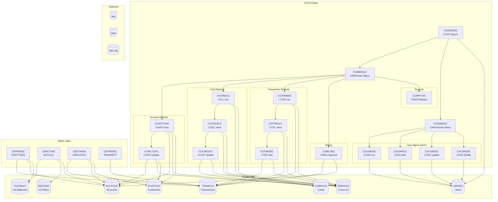
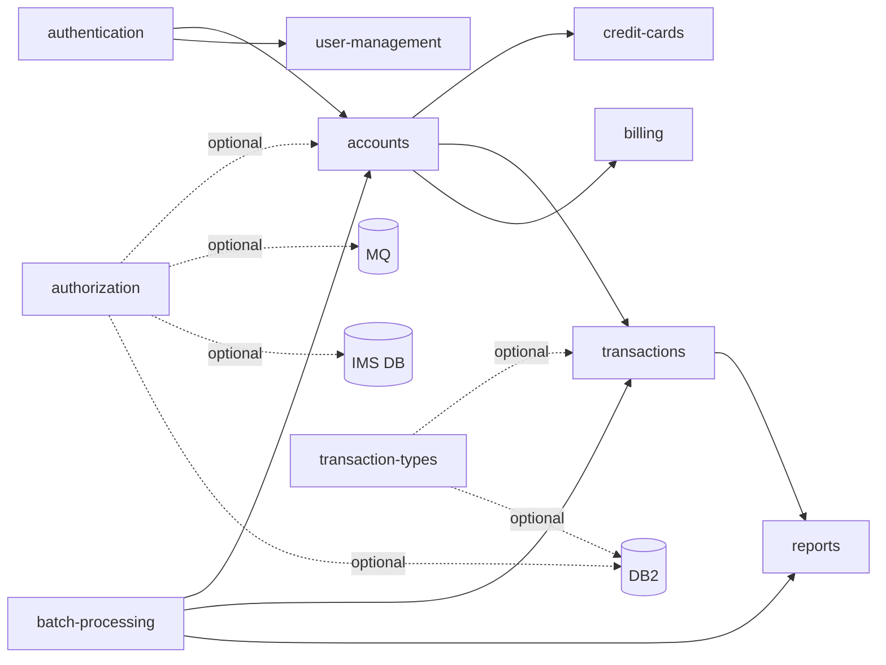

# System CardDemo - Overview for User Stories

**Version:** 2026-03-26  
**Purpose:** Single source of truth for creating well-structured User Stories based on the CardDemo mainframe credit card management application.

---

## 📊 Platform Statistics

- **Technology Stack:** COBOL, CICS, VSAM, JCL, RACF, Assembler (optional: DB2, IMS DB, MQ)
- **Architecture Pattern:** Mainframe OLTP (CICS online) + Batch (JCL), VSAM file-based persistence
- **Key Capabilities:** Account management, credit card management, transaction processing, billing, reporting, user administration
- **User Roles:** Regular Users (card management), Admin Users (system administration)
- **Optional Extensions:** Credit Card Authorizations (IMS/DB2/MQ), Transaction Type Management (DB2), Account Extraction (MQ/VSAM)

---

## 🏗️ High-Level Architecture

### Technology Stack

**Online (CICS):** COBOL programs invoked as CICS transactions via BMS maps (3270 terminal interface)  
**Batch:** COBOL programs executed via JCL jobs on z/OS  
**Data Storage:** VSAM KSDS files (with Alternate Indexes) for all master data  
**Security:** RACF for authentication; user security data stored in VSAM USRSEC file  
**Optional DB:** DB2 for transaction types and authorization audit logs  
**Optional Messaging:** MQ for async authorization and account inquiry requests  
**Optional Hierarchical DB:** IMS DB for customer/authorization data  
**Utility Programs:** Assembler routines (MVSWAIT timer, COBDATFT date conversion)

### Architectural Patterns

- **Screen/Program separation:** Each CICS transaction has a BMS map (screen definition) and a COBOL program
- **Communication Area (COMMAREA):** `CARDDEMO-COMMAREA` (COCOM01Y copybook) passes session state between transactions
- **VSAM KSDS with AIX:** All master files use keyed-sequential access with alternate index support
- **Copybook-based data contracts:** Shared data structures defined in `.cpy` copybooks (CVACT01Y, CVCUS01Y, CVTRA05Y, etc.)
- **Batch/Online integration:** Batch jobs read/update the same VSAM files used online; CICS files must be closed before batch runs
- **Role-based navigation:** Admin vs. Regular user type stored in COMMAREA determines menu flow

### VSAM File Inventory

| VSAM File   | Primary Key         | Content              | Alternate Index   |
|-------------|---------------------|----------------------|-------------------|
| ACCTFILE    | ACCT-ID (9(11))     | Account master       | ACCT-CARD-NUM     |
| CARDFILE    | CARD-NUM (X(16))    | Card master          | CARD-ACCT-ID      |
| CUSTFILE    | CUST-ID (9(09))     | Customer master      | CUST-SSN          |
| TRANFILE    | TRAN-ID (X(16))     | Transaction master   | TRAN-CARD-NUM     |
| XREFFILE    | XREF-CARD-NUM       | Card-Acct-Cust xref  | XREF-ACCT-ID      |
| TCATBALF    | TRAN-CAT-KEY        | Transaction cat bal  | —                 |
| DISCGRP     | DIS-GROUP-KEY       | Interest rate groups | —                 |
| USRSEC      | SEC-USR-ID (X(08))  | User security data   | —                 |

---

## 📚 Module Catalog

<!-- MODULE_LIST_START -->
**Modules:** authentication, accounts, credit-cards, transactions, billing, reports, user-management, batch-processing, authorization, transaction-types
<!-- MODULE_LIST_END -->

---

### 1. Authentication

**ID:** `authentication`  
**Purpose:** User signon and session initialization for the CardDemo application. Entry point for all user interactions — every cardholder and administrator must authenticate here before accessing any other module.

**Key Components:**
- `COSGN00C.cbl` — CICS program (CC00); validates user ID + password against USRSEC VSAM file, initializes COMMAREA, routes to appropriate menu via EXEC CICS XCTL
- `COSGN00.bms` — BMS mapset; defines the 3270 signon screen (24×80) with USERID, PASSWD (dark/hidden), and ERRMSG fields
- `CSUSR01Y.cpy` — SEC-USER-DATA structure (user ID, first/last name, password, type, filler; RECLN=80)
- `COCOM01Y.cpy` — CARDDEMO-COMMAREA shared communication area; authentication initializes CDEMO-USER-ID, CDEMO-USER-TYPE, CDEMO-FROM-TRANID, CDEMO-FROM-PROGRAM, and CDEMO-PGM-CONTEXT
- `COMEN01C.cbl` — downstream: Main Menu for regular users (CM00); receives COMMAREA from authentication
- `COADM01C.cbl` — downstream: Admin Menu (CA00); receives COMMAREA from authentication

**Supporting Copybooks:**
- `COTTL01Y.cpy` — screen title constants (CCDA-TITLE01, CCDA-TITLE02)
- `CSDAT01Y.cpy` — date/time working storage for header (CURDATE, CURTIME fields)
- `CSMSG01Y.cpy` — standard message constants (CCDA-MSG-THANK-YOU, CCDA-MSG-INVALID-KEY)
- `DFHAID` / `DFHBMSCA` — CICS system copybooks for AID key and BMS attribute constants

**CICS Transaction:** `CC00`  
**Screen:** COSGN00 / COSGN0A (Signon Screen, 24×80 3270 terminal)

**Processing Flow:**
1. Cold start (EIBCALEN=0): display blank signon screen with cursor on USERID field
2. User enters User ID (8 chars, case-insensitive) + Password (8 chars, hidden/dark attribute)
3. ENTER key: COSGN00C receives map input, applies FUNCTION UPPER-CASE to both fields
4. Validates non-blank inputs, then performs EXEC CICS READ against USRSEC VSAM (key=User ID)
5. VSAM RESP=0 (found): compares SEC-USR-PWD with entered password (exact 8-char match)
6. On password match: populates CARDDEMO-COMMAREA and XCTLs to target menu program
7. On any failure: redisplays signon screen with specific error message, cursor on failed field
8. PF3 key: displays thank-you message via SEND TEXT, issues CICS RETURN without TRANSID

**Outbound XCTL Targets:**
| Condition | Target Program | Transaction |
|-----------|---------------|-------------|
| SEC-USR-TYPE = 'A' (CDEMO-USRTYP-ADMIN) | COADM01C | CA00 Admin Menu |
| SEC-USR-TYPE = 'U' (default) | COMEN01C | CM00 Main Menu |

**Data Models:**
```cobol
* USRSEC VSAM KSDS — primary key: SEC-USR-ID (offset 0, length 8)
01 SEC-USER-DATA.
  05 SEC-USR-ID      PIC X(08)   -- User ID (primary key, 8 chars)
  05 SEC-USR-FNAME   PIC X(20)   -- First name
  05 SEC-USR-LNAME   PIC X(20)   -- Last name
  05 SEC-USR-PWD     PIC X(08)   -- Password (plain text — demo only)
  05 SEC-USR-TYPE    PIC X(01)   -- 'A'=Admin, 'U'=Regular User
  05 SEC-USR-FILLER  PIC X(23)   -- Reserved (total RECLN=80)

* COMMAREA fields SET by authentication (COCOM01Y.cpy):
  CDEMO-FROM-TRANID  PIC X(04)   -- Set to 'CC00'
  CDEMO-FROM-PROGRAM PIC X(08)   -- Set to 'COSGN00C'
  CDEMO-USER-ID      PIC X(08)   -- Authenticated user ID
  CDEMO-USER-TYPE    PIC X(01)   -- 'A'=Admin / 'U'=User
  CDEMO-PGM-CONTEXT  PIC 9(01)   -- Set to 0 (CDEMO-PGM-ENTER)
```

**Business Rules:**
- BR-01: User ID required (non-blank) → "Please enter User ID ..."
- BR-02: Password required (non-blank) → "Please enter Password ..."
- BR-03/04: Both User ID and Password converted to UPPER-CASE before validation
- BR-05: User ID must exist in USRSEC (RESP=13/NOTFND) → "User not found. Try again ..."
- BR-06: Password must exactly match SEC-USR-PWD (8-char comparison) → "Wrong Password. Try again ..."
- BR-07: PF3 → thank-you message + CICS RETURN (no TRANSID, session ends)
- BR-08: Any other key → "Invalid Key" error, redisplay screen
- BR-09: Admin users routed to COADM01C (CA00 Admin Menu)
- BR-10: Regular users routed to COMEN01C (CM00 Main Menu)
- BR-11: VSAM I/O errors (RESP other than 0/13) → "Unable to verify the User ..."
- BR-12: Failed authentication repositions cursor at the failed input field

**VSAM Response Code Handling:**
| RESP | Meaning | Action |
|------|---------|--------|
| 0 | Normal (record found) | Proceed to password comparison |
| 13 | NOTFND (user not in USRSEC) | Error: "User not found. Try again ..." |
| Other | Unexpected CICS/VSAM error | Error: "Unable to verify the User ..." |

**Internal Dependencies:**
- USRSEC VSAM file must be pre-loaded (DUSRSECJ JCL job using IEBGENER)
- All downstream modules depend on CDEMO-USER-ID and CDEMO-USER-TYPE being set correctly here
- Authentication is a prerequisite for all end-to-end testing of any other module

**Security Notes:**
- Passwords stored as plain text in USRSEC (intentional demo characteristic — must be hashed in production)
- No account lockout after failed attempts (modernization opportunity)
- No session timeout mechanism (modernization opportunity)

**User Story Examples:**
- As a cardholder, I want to sign in with my user ID and password so I can access my account
- As an administrator, I want to log in with admin credentials so I can manage users
- As a user, I want a clear error message when my credentials are wrong so I know to retry
- As a user, I want to press PF3 to exit safely so my session ends cleanly

---

### 2. Accounts

**ID:** `accounts`  
**Purpose:** View and update credit card account details online (CICS); batch account data validation, extract, and monthly interest calculation. The account is the central financial entity — all cards, transactions, billing, and interest are linked to an account record in ACCTFILE.

**Key Components:**
- `COACTVWC.cbl` — CICS program; read-only display of account + customer details (CAVW / COACTVW); resolves card number → XREFFILE → ACCTFILE → CUSTFILE
- `COACTUPC.cbl` — CICS program; full account and customer data update (CAUP / COACTUP); implements optimistic locking with `ACUP-OLD-*` shadow fields and CICS SYNCPOINT ROLLBACK for atomicity
- `CBACT01C.cbl` — Batch: sequential account data validation/processing; reads ACCTFILE, writes multiple output formats
- `CBACT02C.cbl` — Batch: sequential card file read; outputs to SYSOUT
- `CBACT03C.cbl` — Batch: sequential card cross-reference read; outputs CARD-NUM / CUST-ID / ACCT-ID mappings
- `CBACT04C.cbl` — Batch: monthly interest calculation (INTCALC job); reads TCATBALF sequentially, looks up XREFFILE/ACCTFILE/DISCGRP, writes interest transactions to output TRANSACT file
- `COACTVW.bms` / `COACTUP.bms` — BMS map definitions for 24×80 3270 screens
- `CVACT01Y.cpy` — ACCOUNT-RECORD data structure (RECLN=300)
- `CVACT02Y.cpy` — CARD-RECORD data structure (RECLN=150)
- `CVACT03Y.cpy` — CARD-XREF-RECORD data structure (RECLN=50)
- `CVTRA01Y.cpy` — TRAN-CAT-BAL-RECORD (TCATBALF input to CBACT04C)
- `CVTRA02Y.cpy` — DIS-GROUP-RECORD (DISCGRP interest rate structure)

**CICS Transactions:**
- `CAVW` → Account View (read-only); BMS mapset COACTVW, map CACTVWA
- `CAUP` → Account Update (editable); BMS mapset COACTUP, map CACTUPA

**Navigation:** PF3 returns to Main Menu (CM00); PF5 transitions from View to Update

**Data Model:**
```
ACCOUNT-RECORD (ACCTFILE, RECLN=300):
  ACCT-ID                 PIC 9(11)        -- Primary key
  ACCT-ACTIVE-STATUS      PIC X(01)        -- 'Y'=Active, 'N'=Inactive
  ACCT-CURR-BAL           PIC S9(10)V99    -- Current balance
  ACCT-CREDIT-LIMIT       PIC S9(10)V99    -- Credit limit
  ACCT-CASH-CREDIT-LIMIT  PIC S9(10)V99    -- Cash credit limit
  ACCT-OPEN-DATE          PIC X(10)        -- YYYY-MM-DD
  ACCT-EXPIRAION-DATE     PIC X(10)        -- YYYY-MM-DD (note: typo in source copybook)
  ACCT-REISSUE-DATE       PIC X(10)        -- YYYY-MM-DD
  ACCT-CURR-CYC-CREDIT    PIC S9(10)V99    -- Current cycle credits (payments received)
  ACCT-CURR-CYC-DEBIT     PIC S9(10)V99    -- Current cycle debits (charges made)
  ACCT-ADDR-ZIP           PIC X(10)        -- ZIP code
  ACCT-GROUP-ID           PIC X(10)        -- Disclosure group ID → links to DISCGRP
  FILLER                  PIC X(178)       -- Unused (allows future field additions)

CARD-XREF-RECORD (XREFFILE, RECLN=50):
  XREF-CARD-NUM           PIC X(16)        -- Card number (primary key)
  XREF-CUST-ID            PIC 9(09)        -- Customer ID
  XREF-ACCT-ID            PIC 9(11)        -- Account ID (alternate index key)
  FILLER                  PIC X(14)

TRAN-CAT-BAL-RECORD (TCATBALF — input to interest calculation):
  TRANCAT-ACCT-ID         PIC 9(11)        -- Account ID
  TRANCAT-TYPE-CD         PIC X(02)        -- Transaction type code
  TRANCAT-CD              PIC 9(04)        -- Transaction category code
  TRAN-CAT-BAL            PIC S9(09)V99    -- Category balance (interest basis)

DIS-GROUP-RECORD (DISCGRP — interest rate lookup):
  DIS-ACCT-GROUP-ID       PIC X(10)        -- Maps from ACCT-GROUP-ID
  DIS-TRAN-TYPE-CD        PIC X(02)
  DIS-TRAN-CAT-CD         PIC 9(04)
  DIS-INT-RATE            PIC S9(09)V99    -- Annual interest rate (%)
```

**Processing Flows:**
- **Account Lookup Chain (CAVW/CAUP):** Card number (COMMAREA) → READ XREFFILE AIX → get ACCT-ID + CUST-ID → READ ACCTFILE → READ CUSTFILE → display
- **Interest Calculation (CBACT04C):** Sequential read TCATBALF → per record: random READ XREFFILE AIX (by ACCT-ID) + READ ACCTFILE + READ DISCGRP → COMPUTE monthly interest = `(TRAN-CAT-BAL × DIS-INT-RATE) / 1200` → WRITE interest transaction to TRANSACT file
- **Optimistic Locking (CAUP):** Old field values stored as `ACUP-OLD-*` at view time; on update submit, freshly-read VSAM data is compared against old values; mismatch → reject with "data changed" error; on write: READ UPDATE (CICS lock) → REWRITE ACCTFILE → REWRITE CUSTFILE; if CUSTFILE REWRITE fails → `EXEC CICS SYNCPOINT ROLLBACK`

**Business Rules:**
- Account can be looked up by Card Number (via XREFFILE AIX) or Account ID (direct input on view screen)
- `ACCT-ACTIVE-STATUS = 'Y'` required for transactions and billing payments to proceed
- Interest calculation formula: `(TRAN-CAT-BAL × DIS-INT-RATE) / 1200` (annual rate ÷ 12 months)
- If specific DISCGRP key (group+type+category) not found, CBACT04C falls back to `'DEFAULT   '` group key
- Credit limit enforced during transaction add by COTRN02C (not within the accounts module itself)
- Batch jobs (CBACT01C–04C) require CLOSEFIL JCL step before running and OPENFIL after to restore CICS access
- COACTUPC validates: active status (Y/N), numeric balances/limits, dates (YYYY-MM-DD), US phone (NNN)NNN-NNNN, SSN NNN-NN-NNNN, ZIP, FICO score 0–850
- Account update atomically updates both ACCTFILE and CUSTFILE; SYNCPOINT ROLLBACK if second write fails
- `ACCT-EXPIRAION-DATE` field name has a typo (missing 'T') in CVACT01Y.cpy — do not rename without updating all consumers

**Dependencies:**
- **authentication** — COMMAREA CDEMO-USER-ID and CDEMO-CARD-NUM must be set before account screens
- **ACCTFILE, XREFFILE, CUSTFILE** — must be VSAM-loaded before online use
- **TCATBALF, DISCGRP** — required inputs for CBACT04C interest calculation
- **credit-cards, transactions, billing** — downstream consumers of ACCT-ID from COMMAREA and ACCT-ACTIVE-STATUS

**JCL Job:**
- `INTCALC` — runs CBACT04C; parameter = date (YYYYMMDD); outputs GDG versioned TRANSACT(+1) file; must be preceded by CLOSEFIL

**User Story Examples:**
- As a cardholder, I want to view my account balance and credit limit so I know my available credit
- As a cardholder, I want to update my ZIP code so my billing address is current
- As a cardholder, I want to see current cycle credits and debits so I can track billing cycle activity
- As an administrator, I want to change an account's active status so access can be suspended when needed
- As a system, I want to calculate monthly interest so balances are updated at cycle end

---

### 3. Credit Cards

**ID:** `credit-cards`  
**Purpose:** List, view, and update credit card information linked to an account. Enables cardholders to browse cards by account, inspect full card details, and modify mutable attributes (embossed name, active status, expiry date) with optimistic concurrency protection.

**Key Components:**
- `COCRDLIC.cbl` — CICS program (1,459 lines); list cards for an account with pagination (CCLI / COCRDLI)
- `COCRDSLC.cbl` — CICS program (887 lines); view credit card details, read-only (CCDL / COCRDSL)
- `COCRDUPC.cbl` — CICS program (1,560 lines); update credit card record with two-phase confirmation and optimistic locking (CCUP / COCRDUP)
- `CVCRD01Y.cpy` — CC-WORK-AREAS (card navigation work area: AID keys, next program/map pointers, error/return messages, account/card/customer IDs)
- `CVACT02Y.cpy` — CARD-RECORD data structure (CARDFILE, RECLN=150)
- `CVACT03Y.cpy` — CARD-XREF-RECORD data structure (XREFFILE — card-account-customer linkage)
- `COCOM01Y.cpy` — CARDDEMO-COMMAREA shared session communication area
- `CSSETATY.cpy` — BMS attribute byte constants shared with all online modules
- `CSLKPCDY.cpy` — Shared lookup code tables used in field validation

**BMS Maps:**
- `COCRDLI.bms` — Card list screen (7 selectable rows with card number, account, status, expiry)
- `COCRDSL.bms` — Card detail screen (full read-only card record display)
- `COCRDUP.bms` — Card update screen (editable: name, status, expiry month/year/day)

**CICS Transactions:**
- `CCLI` → Credit Card List (paginated, PF7/PF8 navigation)
- `CCDL` → Credit Card View/Detail (read-only)
- `CCUP` → Credit Card Update (two-phase: validate on ENTER, commit on PF5)

**Data Model:**
```
CARD-RECORD (CARDFILE, RECLN=150):
  CARD-NUM              PIC X(16)    -- Card number / 16-digit PAN (primary key)
  CARD-ACCT-ID          PIC 9(11)    -- Linked account ID (also AIX key: ACCT-PATH)
  CARD-CVV-CD           PIC 9(03)    -- CVV security code (plain text, demo only)
  CARD-EMBOSSED-NAME    PIC X(50)    -- Name printed on card face (editable)
  CARD-EXPIRAION-DATE   PIC X(10)    -- Expiry date YYYY-MM-DD (editable)
  CARD-ACTIVE-STATUS    PIC X(01)    -- 'Y'=Active, 'N'=Inactive (editable)
  FILLER                PIC X(59)    -- Padding to RECLN=150

CC-WORK-AREAS (CVCRD01Y.cpy):
  CCARD-AID             PIC X(5)     -- AID key (ENTER / PFKxx / CLEAR)
  CCARD-NEXT-PROG       PIC X(8)     -- Target program for XCTL
  CCARD-NEXT-MAPSET     PIC X(7)     -- Target BMS mapset
  CCARD-NEXT-MAP        PIC X(7)     -- Target BMS map
  CCARD-ERROR-MSG       PIC X(75)    -- Error message for screen display
  CC-ACCT-ID            PIC X(11)    -- Current account ID
  CC-CARD-NUM           PIC X(16)    -- Current card number
  CC-CUST-ID            PIC X(09)    -- Current customer ID
```

**Processing Flows:**
- **Card List:** COCRDLIC reads CARDFILE via CARD-ACCT-ID AIX using VSAM BROWSE (STARTBR/READNEXT/ENDBR). Displays up to 7 cards per page. User selects one row with 'S' (view) or 'U' (update); selected card number is stored in `CDEMO-CARD-NUM` in COMMAREA and program XCTLs to COCRDSLC or COCRDUPC.
- **Card Detail:** COCRDSLC reads CARDFILE by primary key (card number) or falls back to ACCT-PATH AIX when card number is zero. Read-only display.
- **Card Update:** COCRDUPC implements a two-phase update: Phase 1 (ENTER) validates all fields and shows confirmation prompt; Phase 2 (PF5) acquires exclusive VSAM READ UPDATE lock, checks for concurrent modification via paragraph 9300-CHECK-CHANGE-IN-REC, then issues EXEC CICS REWRITE if no conflict.

**Business Rules:**
- Card list filtered by `CDEMO-ACCT-ID` in COMMAREA for regular users; admin users (`CDEMO-USER-TYPE='A'`) can browse all cards
- Card list shows maximum 7 rows per page; PF7=previous page, PF8=next page
- Only one card selection allowed per page submission; multiple selections produce an error
- Card number is 16-digit PAN; must be numeric if provided on update screen
- Card status toggles between 'Y' (Active) and 'N' (Inactive) — only accepted values
- Embossed name must be non-blank and contain only alphabetic characters and spaces
- Expiry month must be 1–12; expiry year must be 1950–2099; day is accepted without calendar validation
- If submitted update values match current DB values, no write is performed ("No change detected")
- Optimistic locking: concurrent modification is detected by comparing locked record with values shown at fetch time; on conflict, screen is refreshed with latest values
- CVV is preserved from the locked DB read and not modifiable via the update screen
- Embossed name may differ from customer legal name on file in CUSTFILE

**Dependencies:**
- `authentication` — must succeed before any credit-cards transaction; provides `CDEMO-USER-ID` and `CDEMO-USER-TYPE`
- `accounts` — provides `CDEMO-ACCT-ID` in COMMAREA as the CARDFILE AIX filter key
- `transactions` (downstream) — reads `CDEMO-CARD-NUM` set by this module to look up transactions
- CARDFILE VSAM KSDS — must have CARD-ACCT-ID alternate index (ACCT-PATH) defined and active
- XREFFILE VSAM KSDS — card-account-customer cross-reference used for validation in COCRDSLC/COCRDUPC

**Error Handling:**
- All VSAM I/O errors produce a structured message: `"File Error: {op} on {file} returned RESP {n},RESP2 {n}"`
- Validation errors are surfaced simultaneously (all errors shown on one screen re-send)
- COCRDSLC and COCRDUPC register CICS ABEND handlers that send a plain-text error screen and return cleanly

**User Story Examples:**
- As a cardholder, I want to see all cards on my account so I know which are active
- As a cardholder, I want to view my card's expiration date so I can plan for renewal
- As a cardholder, I want to deactivate a lost card so unauthorized charges are prevented
- As a cardholder, I want to correct the embossed name on my card so it reflects my legal name
- As an administrator, I want to list all cards across all accounts so I can audit active and inactive cards
- As a system, I want concurrent card updates to be safely handled so card data is never corrupted

---

### 4. Transactions

**ID:** `transactions`  
**Purpose:** List, view, add, and batch-process credit card transactions. Provides three CICS online screens (list, view, add) plus three batch programs for validation, posting, and report generation. Transaction data feeds the billing, reports, and interest-calculation pipelines.

**Key Components:**
- `COTRN00C.cbl` — CICS program; paginated transaction list (CT00 / COTRN00); 10 rows/page; browses TRANFILE via AIX on TRAN-CARD-NUM using STARTBR/READNEXT/READPREV; PF7/PF8 scroll; 'S' to drill into CT01
- `COTRN01C.cbl` — CICS program; transaction view/detail (CT01 / COTRN01); reads TRANSACT by TRAN-ID primary key; displays all TRAN-RECORD fields; PF5 returns to list
- `COTRN02C.cbl` — CICS program; add new transaction (CT02 / COTRN02); validates card/account via CCXREF AIX; generates TRAN-ID via STARTBR HIGH-VALUES + READPREV + increment; PF4 copies last transaction
- `CBTRN01C.cbl` — Batch: transaction file validation; reads DALYTRAN sequential; validates against CUSTFILE, XREFFILE, CARDFILE, ACCTFILE, TRANFILE
- `CBTRN02C.cbl` — Batch: transaction posting (POSTTRAN job); reads DALYTRAN; validates via XREFFILE + ACCTFILE; writes to TRANFILE; updates ACCT-CURR-BAL in ACCTFILE and TRAN-CAT-BAL in TCATBALF; rejects to DALYREJS GDG
- `CBTRN03C.cbl` — Batch: transaction report (TRANREPT job); reads date-filtered, card-sorted TRANFILE; joins TRANTYPE + TRANCATG for descriptions; writes 133-char formatted report lines with page/account/grand totals
- `CVTRA05Y.cpy` — TRAN-RECORD data structure (350 bytes)
- `CVTRA01Y.cpy` — TRAN-CAT-BAL-RECORD structure (50 bytes)
- `CVTRA02Y.cpy` — DIS-GROUP-RECORD structure (50 bytes, used by INTCALC)
- `CVTRA03Y.cpy` — TRAN-TYPE-RECORD (60 bytes; transaction type reference)
- `CVTRA04Y.cpy` — TRAN-CAT-RECORD (60 bytes; category reference)
- `CVTRA06Y.cpy` — DALYTRAN-RECORD (350 bytes; batch sequential input)
- `CVTRA07Y.cpy` — Report layout structures (TRANSACTION-DETAIL-REPORT, totals)

**CICS Transactions:**
- `CT00` → Transaction List (paginated, AIX browse by TRAN-CARD-NUM)
- `CT01` → Transaction View (direct read by TRAN-ID primary key)
- `CT02` → Transaction Add (validates card+account, writes to TRANFILE)

**Batch JCL Jobs:**
| Job        | Program    | Input                  | Key Outputs                          |
|------------|------------|------------------------|--------------------------------------|
| `POSTTRAN` | CBTRN02C   | DALYTRAN sequential    | TRANFILE (write), ACCTFILE (rewrite), TCATBALF (rewrite), DALYREJS (rejects) |
| `TRANREPT` | SORT + CBTRN03C | TRANSACT VSAM + date filter | TRANREPT GDG (133-char report) |
| `COMBTRAN` | SORT + IDCAMS | TRANSACT.BKUP + SYSTRAN | TRANSACT VSAM (combined reload) |

**VSAM Files:**
| DD Name    | Dataset                              | Primary Key       | AIX              |
|------------|--------------------------------------|-------------------|------------------|
| TRANSACT   | AWS.M2.CARDDEMO.TRANSACT.VSAM.KSDS   | TRAN-ID X(16)     | TRAN-CARD-NUM    |
| TCATBALF   | AWS.M2.CARDDEMO.TCATBALF.VSAM.KSDS   | Acct+Type+Cat     | —                |
| DALYTRAN   | AWS.M2.CARDDEMO.DALYTRAN.PS          | — (sequential)    | —                |
| DALYREJS   | AWS.M2.CARDDEMO.DALYREJS(+1)         | — (GDG reject)    | —                |

**Data Model:**
```
TRAN-RECORD (TRANFILE, RECLN=350):                    -- CVTRA05Y.cpy
  TRAN-ID               PIC X(16)        -- Transaction ID (primary key; system-generated sequential)
  TRAN-TYPE-CD          PIC X(02)        -- Transaction type code (links to TRANTYPE VSAM)
  TRAN-CAT-CD           PIC 9(04)        -- Transaction category code (links to TRANCATG VSAM)
  TRAN-SOURCE           PIC X(10)        -- Source system / channel identifier
  TRAN-DESC             PIC X(100)       -- Free-text description
  TRAN-AMT              PIC S9(09)V99    -- Amount: negative=debit/charge, positive=credit/payment
  TRAN-MERCHANT-ID      PIC 9(09)        -- Merchant identifier
  TRAN-MERCHANT-NAME    PIC X(50)        -- Merchant name
  TRAN-MERCHANT-CITY    PIC X(50)        -- Merchant city
  TRAN-MERCHANT-ZIP     PIC X(10)        -- Merchant ZIP code
  TRAN-CARD-NUM         PIC X(16)        -- Associated card PAN (Alternate Index key)
  TRAN-ORIG-TS          PIC X(26)        -- Original timestamp (YYYY-MM-DD HH:MM:SS.ssssss)
  TRAN-PROC-TS          PIC X(26)        -- Processing timestamp

TRAN-CAT-BAL-RECORD (TCATBALF, RECLN=50):             -- CVTRA01Y.cpy
  TRAN-CAT-KEY:
    TRANCAT-ACCT-ID     PIC 9(11)        -- Account ID (composite key part 1)
    TRANCAT-TYPE-CD     PIC X(02)        -- Type code (composite key part 2)
    TRANCAT-CD          PIC 9(04)        -- Category code (composite key part 3)
  TRAN-CAT-BAL          PIC S9(09)V99    -- Running category balance for interest calculation
```

**Business Rules:**
- Transactions listed by Card Number via TRANFILE AIX on TRAN-CARD-NUM; browse uses STARTBR GTEQ
- POSTTRAN (CBTRN02C) posts DALYTRAN records: validates via XREFFILE, then updates ACCTFILE balance and TCATBALF category balance, then writes to TRANFILE; rejects written to DALYREJS GDG
- POSTTRAN returns RC=8 when any rejects exist; DISPLAY outputs reject count to SYSOUT
- Transaction category balance (TCATBALF) is keyed by Account+TypeCode+CategoryCode; read by INTCALC (CBACT04C) with DISCGRP interest rates to compute monthly interest
- Amount sign: negative = debit/charge (reduces balance); positive = credit/payment (increases balance)
- Transaction ID generated in CT02 via STARTBR HIGH-VALUES + READPREV + numeric increment; not concurrency-safe under high volume
- COTRN02C accepts either Account ID or Card Number; resolves the other via CCXREF VSAM lookup
- No online credit-limit check in CT02; credit limit validation only occurs in CBTRN02C batch posting
- TRANREPT job uses SORT INCLUDE to filter by TRAN-PROC-TS date range before running CBTRN03C
- POSTTRAN/TRANREPT require CLOSEFIL before run and OPENFIL after to coordinate with CICS file ownership
- COMMAREA extension fields `CDEMO-CT00-INFO` / `CDEMO-CT01-INFO` carry pagination state (first/last TRAN-ID, page number, next-page flag) across CICS pseudo-conversational interactions
- EIBCALEN=0 guard redirects unauthenticated direct transaction invocations to COSGN00C

**Dependencies:**
- **authentication** — COMMAREA must contain valid CDEMO-USER-ID and CDEMO-CARD-NUM; CT00/CT01/CT02 redirect to COSGN00C if no COMMAREA
- **accounts** — ACCTFILE updated by POSTTRAN; ACCT-GROUP-ID links to DISCGRP for interest rates
- **credit-cards** — XREFFILE / CARDFILE used by CBTRN01C validation and CT02 card-account resolution
- **billing** (downstream) — COBIL00C writes positive transactions to TRANFILE feeding POSTTRAN
- **reports** (downstream) — CORPT00C submits TRANREPT via extra-partition TDQ; CBSTM03A reads TRANFILE
- **transaction-types** (optional) — TRANTYPE / TRANCATG VSAM reference data used in TRANREPT; optionally managed via DB2

**User Story Examples:**
- As a cardholder, I want to view my recent transactions so I can monitor spending
- As a cardholder, I want to see transaction details including merchant name so I can verify charges
- As a cardholder, I want to page through my transaction history so I can find older charges
- As a cardholder, I want to add a transaction manually so I can record a purchase
- As a system, I want to post batch transactions so account balances stay current
- As an auditor, I want a daily transaction report so I can reconcile posted amounts

---

### 5. Billing

**ID:** `billing`  
**Purpose:** Process full-balance bill payments for a credit card account online via CICS  
**Key Components:**
- `COBIL00C.cbl` — CICS program; bill payment processing (CB00 / COBIL00); single-screen pay-in-full flow
- `COBIL00.bms` — BMS map for bill payment screen (mapset COBIL00, map COBIL0A; 24×80)
- `app/cpy-bms/COBIL00.CPY` — BMS-generated copybook; COBIL0AI (input map) and COBIL0AO (output map) structures

**CICS Transaction:** `CB00` → Bill Payment  
**Screen:** COBIL0A (Bill Payment Screen)

**Dependencies (Internal Modules):**
- `authentication` — COMMAREA must be populated (EIBCALEN > 0); otherwise XCTLs to COSGN00C
- `accounts` — reads and rewrites ACCTFILE (ACCT-CURR-BAL, ACCT-ACTIVE-STATUS)
- `transactions` — writes payment TRAN-RECORD to TRANFILE; visible in CT00 Transaction List
- `credit-cards` — reads XREFFILE alternate index (CXACAIX) to resolve card number from account ID

**VSAM Files Accessed:**

| CICS Dataset | VSAM File | Access Mode | Purpose |
|---|---|---|---|
| `ACCTDAT` | ACCTFILE | READ(UPDATE) + REWRITE | Read balance; update balance to zero |
| `CXACAIX` | XREFFILE (AIX) | READ | Resolve XREF-CARD-NUM from XREF-ACCT-ID |
| `TRANSACT` | TRANFILE | STARTBR + READPREV + ENDBR + WRITE | Get max TRAN-ID; write payment record |

**Processing Flow:**
1. User enters 11-digit Account ID in ACTIDIN field, presses ENTER
2. COBIL00C reads ACCTFILE (with UPDATE intent) to retrieve ACCT-CURR-BAL
3. Current balance displayed on screen (CURBAL field); user prompted to confirm (Y/N)
4. User enters 'Y' in CONFIRM field and presses ENTER
5. COBIL00C reads CXACAIX (XREFFILE AIX) to get XREF-CARD-NUM for the account
6. COBIL00C browses TRANFILE backwards from HIGH-VALUES to find highest TRAN-ID; new ID = max + 1
7. TRAN-RECORD written to TRANFILE (type='02', category=2, amount=full balance, source='POS TERM', desc='BILL PAYMENT - ONLINE')
8. ACCTFILE REWRITE: ACCT-CURR-BAL = ACCT-CURR-BAL − TRAN-AMT (reduces to zero)
9. Success message displayed with new TRAN-ID; screen cleared for next use

**Hard-Coded Transaction Constants:**
```
TRAN-TYPE-CD      = '02'
TRAN-CAT-CD       = 2
TRAN-SOURCE       = 'POS TERM'
TRAN-DESC         = 'BILL PAYMENT - ONLINE'
TRAN-MERCHANT-ID  = 999999999  (sentinel value)
TRAN-MERCHANT-NAME= 'BILL PAYMENT'
TRAN-MERCHANT-CITY= 'N/A'
TRAN-MERCHANT-ZIP = 'N/A'
```

**Navigation Keys:**
| Key | Action |
|-----|--------|
| ENTER | Submit / process (account lookup or payment confirmation) |
| PF3 | Return to previous program or COMEN01C |
| PF4 | Clear all input fields |
| Other | "Invalid key" error message |

**Business Rules:**
- Payment is **full-balance only** — the amount is always `ACCT-CURR-BAL`; no partial payment input exists
- Account ID must not be blank; account must exist in ACCTFILE
- Balance must be > 0; zero/negative balance returns "You have nothing to pay..."
- CONFIRM field must be 'Y' or 'y' to process payment; 'N'/'n' clears screen without payment
- Transaction ID generated sequentially (browse TRANFILE for max + 1); race condition possible on concurrent payments
- TRANFILE WRITE occurs before ACCTFILE REWRITE; failure between these steps leaves data inconsistent (no atomic rollback)
- `ACCT-CURR-CYC-CREDIT` is **not** updated by the current code despite prior documentation stating it is — only `ACCT-CURR-BAL` is modified

**User Story Examples:**
- As a cardholder, I want to pay my outstanding balance in full so my account is cleared
- As a cardholder, I want to see my current balance on the payment screen so I know my total amount owed before confirming
- As a cardholder, I want to receive a transaction ID after payment so I have an audit reference
- As a system, I want to record payment transactions in TRANFILE so the audit trail is complete and visible in transaction history

---

### 6. Reports

**ID:** `reports`  
**Purpose:** Generate and display transaction reports and account statements  
**Key Components:**
- `CORPT00C.cbl` — CICS program; report request/submit screen (CR00 / CORPT00); builds inline JCL and writes to JOBS Extra Partition TDQ to submit TRANREPT batch job
- `CORPT00.bms` — BMS map (CORPT0A mapset); 3270 screen with report type selection (Monthly/Yearly/Custom), date entry fields, and confirmation prompt
- `CBSTM03A.CBL` — Batch: statement orchestrator (CREASTMT job); iterates all accounts via XREFFILE, calls CBSTM03B for I/O; produces both plain-text and HTML output
- `CBSTM03B.CBL` — Batch: file I/O subroutine called by CBSTM03A; handles TRNXFILE, XREFFILE, CUSTFILE, ACCTFILE open/close/read via parameter interface
- `CBTRN03C.cbl` — Batch: daily transaction detail report (TRANREPT job); reads date-sorted TRANFILE, looks up type/category descriptions, writes 133-char fixed-width report with page/account/grand totals
- `CVTRA07Y.cpy` — Report data structures (REPORT-NAME-HEADER, TRANSACTION-DETAIL-REPORT, REPORT-PAGE-TOTALS, REPORT-ACCOUNT-TOTALS, REPORT-GRAND-TOTALS)
- `COSTM01.cpy` — TRNX-RECORD layout (composite key: card-number + tran-id) used by CBSTM03A/B for TRNXFILE access
- `TRANREPT.jcl` — Standalone TRANREPT job: copies TRANSACT VSAM → GDG(+1), SORT-filters by date range, runs CBTRN03C, writes report to GDG
- `CREASTMT.JCL` — Statement job: creates TRNXFILE VSAM (card+tran-id key), runs CBSTM03A, produces STATEMNT.PS (text) and STATEMNT.HTML output datasets

**CICS Transaction:** `CR00` → Transaction Reports (screen CORPT0A)

**Report Types:**
- **Daily Transaction Report (DALYREPT):** Summarizes transactions by card/account, type, and category within a date range; includes page totals (every 20 lines), account totals, and grand total; output to GDG `AWS.M2.CARDDEMO.TRANREPT(+1)`
- **Account Statement (CREASTMT):** Full statement per account with cardholder name, address, current balance, FICO score, and transaction summary; dual output — plain text (`STATEMNT.PS`) and HTML (`STATEMNT.HTML`)

**Online ↔ Batch Integration (CICS TDQ Pattern):**
- CORPT00C embeds full TRANREPT JCL in working storage (`JOB-DATA`, up to 1000 × 80-byte records)
- Date parameters are interpolated into JCL SYMNAMES and DATEPARM DD at runtime
- Each JCL record written to Extra Partition TDQ `JOBS` via `EXEC CICS WRITEQ TD`
- z/OS Internal Reader picks up the JOBS TDQ and submits the batch job

**Screen Fields (CORPT0A):**
- `MONTHLY` / `YEARLY` / `CUSTOM` — report type selection (1-char unprotected fields)
- `SDTMM`, `SDTDD`, `SDTYYYY` — start date (MM/DD/YYYY, enabled for Custom only)
- `EDTMM`, `EDTDD`, `EDTYYYY` — end date (MM/DD/YYYY, enabled for Custom only)
- `CONFIRM` — Y/N confirmation before job submission
- `ERRMSG` — error/status display (line 23, RED attribute)

**Report Output Structure:**
```
TRANSACTION-DETAIL-REPORT line (133 chars):
  TRAN-REPORT-TRANS-ID    PIC X(16)        -- Transaction ID
  TRAN-REPORT-ACCOUNT-ID  PIC X(11)        -- Account ID (from XREFFILE)
  TRAN-REPORT-TYPE-CD     PIC X(02)        -- Type code
  TRAN-REPORT-TYPE-DESC   PIC X(15)        -- Type description (from TRANTYPE VSAM)
  TRAN-REPORT-CAT-CD      PIC 9(04)        -- Category code
  TRAN-REPORT-CAT-DESC    PIC X(29)        -- Category description (from TRANCATG VSAM)
  TRAN-REPORT-SOURCE      PIC X(10)        -- Source system/channel
  TRAN-REPORT-AMT         PIC -ZZZ,ZZZ,ZZZ.ZZ -- Amount with sign

Totals lines:
  REPORT-PAGE-TOTALS    → "Page Total"    + dots(86) + PIC +ZZZ,ZZZ,ZZZ.ZZ
  REPORT-ACCOUNT-TOTALS → "Account Total" + dots(84) + PIC +ZZZ,ZZZ,ZZZ.ZZ
  REPORT-GRAND-TOTALS   → "Grand Total"   + dots(86) + PIC +ZZZ,ZZZ,ZZZ.ZZ
```

**VSAM File Dependencies:**

| VSAM File | Used By | Purpose |
|-----------|---------|---------|
| TRANSACT.VSAM.KSDS | CBTRN03C (via GDG) | Transaction records (date-filtered, card-sorted) |
| CARDXREF.VSAM.KSDS | CBTRN03C, CBSTM03B | Card → Account → Customer cross-reference |
| TRANTYPE.VSAM.KSDS | CBTRN03C | Transaction type descriptions |
| TRANCATG.VSAM.KSDS | CBTRN03C | Category descriptions (key: type-cd + cat-cd) |
| ACCTDATA.VSAM.KSDS | CBSTM03B | Account balance, credit limit for statements |
| CUSTDATA.VSAM.KSDS | CBSTM03B | Customer name and address for statement header |
| TRXFL.VSAM.KSDS | CBSTM03B | Pre-built TRNXFILE (card+tran-id key) for statements |

**Business Rules:**
- Reports require start and end date (YYYY-MM-DD); Monthly/Yearly dates auto-computed; Custom validated via CSUTLDTC subroutine
- Confirmation (Y/N) required before TRANREPT job is submitted from CICS
- CBTRN03C filters on `TRAN-PROC-TS(1:10)` (processing date, not transaction/purchase date)
- Page size in CBTRN03C is fixed at 20 lines per page (WS-PAGE-SIZE = 20)
- TRANREPT uses GDG versioning — each run creates `TRANREPT(+1)`; prior generations preserved for audit
- CREASTMT overwrites STATEMNT.PS and STATEMNT.HTML on each run (no GDG versioning for statements)
- CREASTMT processes all accounts/transactions without date range filtering
- CORPT00C redirects to COSGN00C if EIBCALEN = 0 (unauthenticated access)
- CBSTM03A intentionally uses ALTER/GO TO patterns as a modernization exercise target

**User Story Examples:**
- As a cardholder, I want to generate a monthly transaction report from the CICS screen so I can review my current-month spending
- As a cardholder, I want to enter a custom date range for my report so I can investigate charges in a specific period
- As a system operator, I want to run the TRANREPT batch job for a date range so I can reconcile posted transaction totals
- As an administrator, I want to run monthly statements so all customers receive billing summaries in text and HTML format
- As an auditor, I want daily transaction reports stored in GDG so I can compare month-over-month posted amounts

---

### 7. User Management

**ID:** `user-management`  
**Purpose:** Administrative management of system users (list, add, update, delete) via CICS 3270 screens; exclusively available to Admin-type users  
**Key Components:**
- `COADM01C.cbl` — CICS program; Admin Menu (CA00 / COADM01); routes to user management and optional DB2 transaction-type programs via a 6-option table defined in `COADM02Y.cpy`
- `COUSR00C.cbl` — CICS program; list users (CU00 / COUSR00); paginated VSAM sequential browse, 10 users per page, with row selection for update (`U`) or delete (`D`)
- `COUSR01C.cbl` — CICS program; add user (CU01 / COUSR01); validates all five required fields, writes new USRSEC record, handles duplicate-key error
- `COUSR02C.cbl` — CICS program; update user (CU02 / COUSR02); reads USRSEC with exclusive UPDATE lock, allows field edits, rewrites updated record
- `COUSR03C.cbl` — CICS program; delete user (CU03 / COUSR03); two-step confirmation before hard-deleting USRSEC record
- `CSUSR01Y.cpy` — `SEC-USER-DATA` record layout (80 bytes including 23-byte filler)
- `COADM02Y.cpy` — `CARDDEMO-ADMIN-MENU-OPTIONS` table with 6 admin menu entries (program names and display text)
- `COADM01.bms` — Admin menu BMS map
- `COUSR00.bms` — `COUSR01.bms` — `COUSR02.bms` — `COUSR03.bms` — BMS maps for each user management screen
- `DUSRSECJ.jcl` — JCL job; creates and populates USRSEC VSAM KSDS via IEBGENER + IDCAMS REPRO (5 admin + 5 regular seed users)

**CICS Transactions:**
- `CA00` → Admin Menu
- `CU00` → List Users (paginated, PF7/PF8 navigation)
- `CU01` → Add User
- `CU02` → Update User
- `CU03` → Delete User

**Public Interfaces:**
- All interactions via CICS 3270 terminal (BMS maps); no REST or HTTP API
- Inter-program communication via `CARDDEMO-COMMAREA` (COCOM01Y.cpy); selected User ID passed in `CDEMO-CU00-USR-SELECTED`; action flag (`U`/`D`) in `CDEMO-CU00-USR-SEL-FLG`

**Dependencies:**
- `authentication` module (prerequisite): `COSGN00C` must establish `CDEMO-USER-TYPE='A'` before any user-management screen is accessible; both modules share the USRSEC VSAM file
- `transaction-types` module (optional): Admin Menu options 5–6 route to DB2-based programs; requires IBM DB2; guarded by PGMIDERR HANDLE CONDITION in COADM01C

**Data Model:**
```cobol
SEC-USER-DATA (USRSEC VSAM KSDS, RECLN=80, KEY=8 at offset 0):
  SEC-USR-ID      PIC X(08)   -- User ID (primary key, 8 chars, left-justified)
  SEC-USR-FNAME   PIC X(20)   -- First name
  SEC-USR-LNAME   PIC X(20)   -- Last name
  SEC-USR-PWD     PIC X(08)   -- Password (plain text, demo design)
  SEC-USR-TYPE    PIC X(01)   -- 'A'=Admin, 'U'=Regular User
  SEC-USR-FILLER  PIC X(23)   -- Unused filler
```

**VSAM File:** `AWS.M2.CARDDEMO.USRSEC.VSAM.KSDS` — KEYS(8,0), RECORDSIZE(80,80), CISZ(8192)

**Business Rules:**
- Only Admin users can access user management (`CDEMO-USER-TYPE = 'A'` in COMMAREA); any program with `EIBCALEN = 0` redirects to signon
- User ID uniqueness enforced by VSAM KSDS primary key; COUSR01C handles `DFHRESP(DUPKEY/DUPREC)` with a user-facing error message
- User type value (`'A'` or `'U'`) controls menu routing for the entire session after signon
- All five fields (First Name, Last Name, User ID, Password, User Type) are required on add; sequential validation with targeted cursor placement on the first blank field
- Delete is a hard delete from USRSEC (no soft-delete or deactivation flag); requires two-step confirmation (view then ENTER)
- Update and delete use `CICS READ ... UPDATE` for exclusive record locking before modification
- Password stored as plain text in USRSEC (demo design; must be hashed in any production modernization)
- List screen displays 10 users per page; page state preserved in COMMAREA (`CDEMO-CU00-USRID-FIRST/LAST`, `CDEMO-CU00-PAGE-NUM`)
- `CDEMO-ADMIN-OPT-COUNT` in COADM02Y controls how many menu options are shown (set to 4 to hide optional DB2 options 5–6)
- Initial USRSEC populated via DUSRSECJ JCL (IEBGENER in-stream → IDCAMS REPRO into VSAM); re-running resets all users to seed data

**User Story Examples:**
- As an administrator, I want to view all system users so I can audit access
- As an administrator, I want to add a new user so they can access the system
- As an administrator, I want to update a user's password so they can regain access
- As an administrator, I want to update a user's type so their permissions are correct
- As an administrator, I want to delete an inactive user so unauthorized access is prevented
- As a system operator, I want to initialize the user security file so the application has default users

---

### 8. Batch Processing

**ID:** `batch-processing`  
**Purpose:** Backend batch jobs for account maintenance, transaction posting, interest calculation, statement generation, data import/export, and VSAM file lifecycle management in the CardDemo mainframe credit card application  
**Location:** `app/cbl/CB*.cbl`, `app/cbl/COBSWAIT.cbl`, `app/cbl/CSUTLDTC.cbl`, `app/jcl/`

**Key Components:**

*Transaction Processing:*
- `CBTRN01C.cbl` — Transaction validation batch: verifies card, account, and customer records for each daily transaction; writes rejects to DALYREJS
- `CBTRN02C.cbl` — Transaction posting (POSTTRAN job): reads DALYTRAN.PS, posts to TRANFILE VSAM, updates ACCTFILE balance and TCATBALF category balances; rejected records to GDG
- `CBTRN03C.cbl` — Transaction detail report (TRANREPT job): reads filtered/sorted transaction file; looks up type and category descriptions; produces LRECL=133 report GDG

*Interest and Account Processing:*
- `CBACT04C.cbl` — Interest calculator (INTCALC job): reads TCATBALF sequentially; looks up interest rate from DISCGRP by account group/type/category composite key; writes system-generated interest transactions to SYSTRAN GDG; updates ACCTFILE balances. Accepts PARM=YYYYMMDD (billing cycle date).
- `CBACT01C.cbl` — Account data extract: reads ACCTFILE sequentially; writes to OUTFILE, ARRYFILE, VBRCFILE for downstream processing
- `CBACT02C.cbl` — Card data print/copy: reads CARDFILE sequentially using CVACT02Y copybook
- `CBACT03C.cbl` — XREF data print/copy: reads XREFFILE sequentially using CVACT03Y copybook

*Statement Generation:*
- `CBSTM03A.CBL` — Statement driver (CREASTMT job): reads TRNXFILE sequentially; calls CBSTM03B subroutine; produces plain-text (STMTFILE, LRECL=80) and HTML (HTMLFILE, LRECL=100) outputs; uses ALTER/GO TO, COMP/COMP-3 variables, 2-dimensional arrays
- `CBSTM03B.CBL` — Statement detail processor: subroutine called by CBSTM03A; formats individual records; exercises mainframe control block addressing

*Customer and Data Management:*
- `CBCUS01C.cbl` — Customer file processing: reads CUSTFILE sequentially using CVCUS01Y copybook
- `CBIMPORT.cbl` — Branch migration import: reads multi-record indexed export file; splits into normalized CUSTOUT/ACCTOUT/XREFOUT/TRNXOUT files; validates checksums; generates statistics and error reports
- `CBEXPORT.cbl` — Branch migration export: reads CUSTFILE, ACCTFILE, XREFFILE, TRANSACT, CARDFILE; creates typed multi-record export file with processing statistics

*Utilities:*
- `COBSWAIT.cbl` — Assembler-based wait utility (WAITSTEP job): reads centisecond delay value from SYSIN (e.g. 00003600 = 36 seconds)
- `CSUTLDTC.cbl` — Date conversion subroutine: called by batch and online programs; uses CSUTLDPY/CSUTLDWY copybooks

**Key JCL Jobs:**
| Job       | Program(s)          | Function                                                    |
|-----------|---------------------|-------------------------------------------------------------|
| POSTTRAN  | CBTRN02C            | Post daily transactions; update ACCTFILE + TCATBALF         |
| INTCALC   | CBACT04C            | Compute monthly interest; write SYSTRAN GDG; update balances |
| CREASTMT  | CBSTM03A/B          | Generate plain-text + HTML account statements               |
| TRANREPT  | SORT + CBTRN03C     | Filter/sort transactions by date; produce formatted report  |
| COMBTRAN  | SORT + IDCAMS       | Merge SYSTRAN(0) + TRANSACT.BKUP(0); reload TRANSACT VSAM   |
| CLOSEFIL  | SDSF                | CEMT SET FILE CLOSE for CICS VSAM files before batch        |
| OPENFIL   | SDSF                | CEMT SET FILE OPEN to restore CICS access after batch       |
| WAITSTEP  | COBSWAIT            | Configurable centisecond delay between batch steps          |
| CBIMPORT  | CBIMPORT            | Import branch migration data into CardDemo VSAM files       |
| CBEXPORT  | CBEXPORT            | Export CardDemo data for branch migration                   |

**VSAM File Refresh Jobs:**
- `ACCTFILE`, `CARDFILE`, `CUSTFILE`, `TRANFILE` — IDCAMS REPRO from source sequential datasets
- `XREFFILE` — IDCAMS REPRO + AIX path rebuild for alternate index access
- `TCATBALF` — Reload transaction category balance file
- `DISCGRP` — Load interest rate disclosure group definitions
- `DEFGDGB` / `DEFGDGD` — Define GDG bases for versioned output datasets

**Dependencies:**
- **Internal:** accounts (ACCTFILE read/update), transactions (TRANFILE/TCATBALF update), reports (TRANREPT output consumed by CR00 CICS screen), credit-cards (CARDFILE/XREFFILE read)
- **Platform:** z/OS JES2, VSAM KSDS, GDG, DFSORT/SYNCSORT, IDCAMS, SDSF, CICS region CICSAWSA
- **Load Library:** `AWS.M2.CARDDEMO.LOADLIB` (STEPLIB for all batch steps)
- **Proc Library:** `AWS.M2.CARDDEMO.PROC` (REPROC proc used in TRANREPT)

**Key Copybooks:**
| Copybook      | Used By              | Provides                              |
|---------------|----------------------|---------------------------------------|
| CVTRA01Y.cpy  | CBACT04C, CBTRN02C   | TRAN-CAT-BAL-RECORD (TCATBALF)        |
| CVTRA02Y.cpy  | CBACT04C             | DIS-GROUP-RECORD (DISCGRP rates)      |
| CVACT01Y.cpy  | CBSTM03A, CBACT04C   | ACCOUNT-RECORD layout                 |
| CVACT02Y.cpy  | CBACT02C             | CARD-RECORD layout                    |
| CVACT03Y.cpy  | CBACT03C, CBSTM03A   | CARD-XREF-RECORD layout               |
| CVCUS01Y.cpy  | CBCUS01C             | CUSTOMER-RECORD layout                |
| CVTRA07Y.cpy  | CBTRN03C             | TRANSACTION-DETAIL-REPORT line layout |

**Business Rules:**
- CLOSEFIL **must** precede any batch job updating VSAM files shared with CICS (TRANSACT, ACCTDAT, CCXREF, CXACAIX, USRSEC); OPENFIL must follow
- Interest calculation (INTCALC): DISCGRP composite key = `ACCT-GROUP-ID || TRAN-TYPE-CD || TRAN-CAT-CD`; missing key → error in SYSOUT, record skipped
- Transaction posting (POSTTRAN): updates `ACCT-CURR-BAL`, `ACCT-CURR-CYC-CREDIT/DEBIT`, and TCATBALF; failed lookups go to DALYREJS GDG(+1)
- GDG datasets used for: DALYREJS, TRANSACT.BKUP, SYSTRAN, TRANSACT.DALY, TRANSACT.COMBINED, TRANREPT — prior generations retained for audit trail
- COMBTRAN merges SYSTRAN GDG(0) + TRANSACT.BKUP GDG(0) after INTCALC before CREASTMT can run
- CBIMPORT validates checksums per imported record group; CBEXPORT reads all five normalized files to produce typed export
- COBSWAIT (WAITSTEP) centisecond delay specified via SYSIN DD (e.g. `00003600` = 36 seconds)

**Processing Flows:**

*Nightly:* CLOSEFIL → POSTTRAN → OPENFIL  
*Monthly:* CLOSEFIL → TRANBKP → INTCALC → COMBTRAN → OPENFIL → CREASTMT → TRANREPT  
*Report only:* TRANREPT (update date range in JCL SYMNAMES first)

**User Story Examples:**
- As a system operator, I want to run nightly transaction posting so account balances are updated each business day
- As a system operator, I want to run monthly interest calculation so statements reflect accrued interest charges
- As a system operator, I want to generate account statements so customers receive accurate billing summaries
- As a system operator, I want to refresh master files so the test environment is reset to a known state
- As a system, I want CICS files closed before batch updates so data integrity is maintained between online and batch processing
- As a system operator, I want to import branch migration data so new customers and accounts are loaded into CardDemo

---

### 9. Authorization (Optional — IMS/DB2/MQ)

**ID:** `authorization`  
**Purpose:** Credit card authorization processing using IMS hierarchical database, DB2 relational database, and IBM MQ message queuing. Extends CardDemo with real-time authorization flows, fraud detection, and operational authorization management.  
**Location:** `app/app-authorization-ims-db2-mq/`  
**Key Components:**
- `COPAUA0C.cbl` — CICS; Authorization request processor, MQ-triggered (CP00); reads VSAM files, applies business rules, inserts/updates IMS, sends MQ response
- `COPAUS0C.cbl` — CICS; Pending Authorization Summary display (CPVS / COPAU00); reads IMS PAUTSUM0 segment
- `COPAUS1C.cbl` — CICS; Pending Authorization Details display (CPVD / COPAU01); reads IMS PAUTDTL1 segments; calls COPAUS2C for fraud marking
- `COPAUS2C.cbl` — CICS; Fraud marking and DB2 update (called by COPAUS1C); inserts DB2 AUTHFRDS row, updates IMS PAUTDTL1
- `CBPAUP0C.cbl` — Batch IMS BMP; Purge expired pending authorizations (CBPAUP0J); adjusts credit balances; supports IMS checkpoint/restart
- `DBUNLDGS.CBL / PAUDBLOD.CBL / PAUDBUNL.CBL` — IMS database load/unload utilities
- `COPAU00.bms / COPAU01.bms` — BMS maps for summary and detail screens
- `CIPAUSMY.cpy` — IMS PAUTSUM0 segment copybook (authorization summary)
- `CIPAUDTY.cpy` — IMS PAUTDTL1 segment copybook (authorization details)
- `CCPAURQY.cpy` — MQ authorization request structure
- `CCPAURLY.cpy` — MQ authorization response structure
- `CCPAUERY.cpy` — Error log record structure (multi-subsystem classification)
- `IMSFUNCS.cpy` — IMS DL/I function codes (GU, GHU, GN, REPL, ISRT, DLET, etc.)

**CICS Transactions:**
- `CP00` → Authorization processor (MQ trigger; processes up to 500 messages per invocation)
- `CPVS` → Pending Authorization Summary (reads IMS PAUTSUM0 and VSAM account/customer data)
- `CPVD` → Pending Authorization Details (reads IMS PAUTDTL1; supports fraud marking; requires DB2 plan)
- `CDRD` → Date conversion utility (CODATE01)
- `CDRA` → Account inquiry utility (COACCT01)

**IMS DB Structure:**
```
DBPAUTP0 (HIDAM Primary Database):
  PAUTSUM0 [ROOT, 100 bytes]         -- Account-level authorization summary
    Key: ACCNTID (packed 6 bytes)    -- Account ID
    Fields: credit/cash limits and balances, approved/declined counts and amounts
    LCHILD: DBPAUTX0.PAUTINDX        -- Index pointer

  PAUTDTL1 [CHILD of PAUTSUM0, 200 bytes]  -- Per-transaction authorization record
    Key: PAUT9CTS (char 8 bytes)     -- Composite date/time (unique)
    Fields: card number, auth type, expiry, response code, amounts,
            merchant details, transaction ID, match status (P/D/E/M), fraud flag

DBPAUTX0 (HIDAM Index Database):
  PAUTINDX -- Indexes PAUTSUM0 by account ID for direct GU access

PSBs:
  PSBPAUTB -- BMP PSB; PCB offset +1 (online), +2 (batch)
  PSBPAUTL -- Load PSB for database load/unload utilities
```

**DB2 Schema:**
```sql
-- Fraud tracking table (ddl/AUTHFRDS.ddl)
CREATE TABLE CARDDEMO.AUTHFRDS (
  CARD_NUM              CHAR(16)    NOT NULL,   -- Card PAN
  AUTH_TS               TIMESTAMP   NOT NULL,   -- Authorization timestamp
  AUTH_TYPE             CHAR(4),
  CARD_EXPIRY_DATE      CHAR(4),
  AUTH_ID_CODE          CHAR(6),
  AUTH_RESP_CODE        CHAR(2),                -- '00'=Approved
  AUTH_RESP_REASON      CHAR(4),
  TRANSACTION_AMT       DECIMAL(12,2),
  APPROVED_AMT          DECIMAL(12,2),
  MERCHANT_ID           CHAR(15),
  MERCHANT_NAME         VARCHAR(22),
  MATCH_STATUS          CHAR(1),                -- P/D/E/M
  AUTH_FRAUD            CHAR(1),                -- F=Fraud, R=Removed
  FRAUD_RPT_DATE        DATE,
  ACCT_ID               DECIMAL(11),
  CUST_ID               DECIMAL(9),
  PRIMARY KEY (CARD_NUM, AUTH_TS)
);
-- Index: CARDDEMO.XAUTHFRD on (CARD_NUM ASC, AUTH_TS DESC)
```

**MQ Interface:**
- Input queue: `AWS.M2.CARDDEMO.PAUTH.REQUEST` — receives CSV authorization requests
- Reply queue: `AWS.M2.CARDDEMO.PAUTH.REPLY` — sends approve/decline responses
- Request fields: auth-date/time, card-num, auth-type, card-expiry, message-type, message-source, processing-code, transaction-amount, MCC, acquirer-country, POS-entry-mode, merchant details, transaction-ID
- Response fields: card-num, transaction-ID, auth-ID-code, response-code, response-reason, approved-amount

**Integration Points:**
- **MQ:** Receives authorization requests via CICS trigger; sends approve/decline responses
- **IMS DB:** Stores authorization summary (PAUTSUM0) and detail (PAUTDTL1) records using DL/I GU/GN/GNP/REPL/ISRT/DLET calls
- **DB2:** AUTHFRDS table stores fraud-flagged records via SQL INSERT in COPAUS2C; requires DB2 plan bound for CPVD transaction
- **VSAM:** ACCTFILE, CARDFILE, CUSTFILE, XREFFILE used for card/account validation during CP00

**Authorization Decision Rules (evaluated in order):**
1. Card fraud flag set in IMS → DECLINE (CARD-FRAUD)
2. Merchant fraud flag → DECLINE (MERCHANT-FRAUD)
3. Account inactive (ACCT-ACTIVE-STATUS ≠ 'Y') → DECLINE (ACCOUNT-CLOSED)
4. Card inactive (CARD-ACTIVE-STATUS ≠ 'Y') → DECLINE (CARD-NOT-ACTIVE)
5. Transaction amount > PA-CREDIT-LIMIT (IMS) → DECLINE (INSUFFICIENT-FUND)
6. Transaction amount > ACCT-CREDIT-LIMIT (VSAM fallback) → DECLINE (INSUFFICIENT-FUND)
- Response code `00` = Approved (approved amount = transaction amount)
- Response code non-`00` = Declined (approved amount = 0)

**Match Status Values:**
- `P` = Pending (not yet matched to posted transaction)
- `D` = Declined by authorization processor
- `E` = Expired pending (set during CBPAUP0J batch purge)
- `M` = Matched to a posted TRANFILE transaction

**Batch Jobs:**
- `CBPAUP0J` — Purges PAUTDTL1 segments older than P-EXPIRY-DAYS (JCL PARM) with status 'P'; adjusts PA-CREDIT-BALANCE; deletes empty PAUTSUM0 roots; issues IMS checkpoints for restart
- `LOADPADB.JCL / UNLDPADB.JCL` — IMS database load and unload for data management
- `DBPAUTP0.JCL` — Initial IMS database initialization

**Business Rules:**
- Authorization requests arrive via MQ trigger; CP00 processes up to 500 messages per invocation
- Pending authorizations viewable in summary (CPVS) and detail (CPVD) screens
- Fraud marking via CPVD updates both IMS (PAUTDTL1) and DB2 (AUTHFRDS) in same unit of work
- Expired pending authorizations purged by CBPAUP0J; credit holds released on deletion
- DB2 schema name in COPAUS2C and DDL scripts must be updated to match target environment
- This module requires IMS, DB2, and MQ to be configured; base CardDemo must be deployed first

**User Story Examples:**
- As a cardholder, I want to view pending authorizations so I can see charges not yet posted to my account
- As a cardholder, I want to view authorization details so I can see the merchant and amount for a specific charge
- As an authorization system, I want to process incoming MQ requests so charges are approved or declined in real time
- As a fraud analyst, I want to mark a suspicious authorization as fraudulent so the account is protected from further charges
- As a system operator, I want to purge expired authorizations nightly so the IMS database stays lean and credit holds are released

---

### 10. Transaction Types (Optional — DB2)

**ID:** `transaction-types`  
**Purpose:** Maintain and manage transaction type reference data using DB2 relational tables; provides admin CICS screens for add/edit/delete/browse, a batch bulk-maintenance program, and daily extract jobs that bridge DB2 data to VSAM-based batch reporting  
**Location:** `app/app-transaction-type-db2/`  
**Key Components:**
- `COTRTUPC.cbl` — CICS; Transaction Type add/edit/delete single record (CTTU / COTRTUP mapset)
- `COTRTLIC.cbl` — CICS; Transaction Type list/browse/filter with per-row delete/update (CTLI / COTRTLI mapset)
- `COBTUPDT.cbl` — Batch; Bulk insert/update/delete from sequential flat-file INPFILE (MNTTRDB2 job)
- `COTRTUP.bms` / `COTRTLI.bms` — BMS map definitions for both CICS screens
- `DCLTRTYP.dcl` — DCLGEN host-variable declaration for CARDDEMO.TRANSACTION_TYPE
- `DCLTRCAT.dcl` — DCLGEN host-variable declaration for CARDDEMO.TRANSACTION_TYPE_CATEGORY
- `CSDB2RWY.cpy` — Common DB2 working-storage (SQLCA, DSNTIAC variables)
- `CSDB2RPY.cpy` — Common DB2 procedures (priming query, error formatter)
- `ddl/TRNTYPE.ddl` / `ddl/TRNTYCAT.ddl` — DB2 CREATE TABLE DDL
- `ctl/DB2CREAT.ctl` — Full DB2 setup DDL (database, tablespaces, tables, indexes, grants)
- `ctl/DB2LTTYP.ctl` — Seed INSERT statements for TRANSACTION_TYPE (7 types)
- `ctl/DB2LTCAT.ctl` — Seed INSERT statements for TRANSACTION_TYPE_CATEGORY

**CICS Transactions:**
- `CTTU` → Transaction Type add/edit/delete (DB2 SELECT, UPDATE, INSERT, DELETE + EXEC CICS SYNCPOINT)
- `CTLI` → Transaction Type list/browse with filter (DB2 bidirectional cursors C-TR-TYPE-FORWARD / C-TR-TYPE-BACKWARD + DELETE)

**Integration Points:**
- **DB2 (SSID: DAZ1):** All transaction type data stored in CARDDEMO DB2 database (not VSAM)
  - `CARDDEMO.TRANSACTION_TYPE` — type code (CHAR 2) + description (VARCHAR 50)
  - `CARDDEMO.TRANSACTION_TYPE_CATEGORY` — type+category composite PK with FK to TRANSACTION_TYPE (ON DELETE RESTRICT)
- **JCL:** CREADB21 creates DB2 database, tablespaces, tables, indexes and loads seed data; TRANEXTR uses DSNTIAUL to extract current DB2 data to flat files (TRANTYPE.PS, TRANCATG.PS) for TRANREPT batch report; MNTTRDB2 runs COBTUPDT for bulk maintenance

**DB2 Schema:**
```sql
-- Primary table
CREATE TABLE CARDDEMO.TRANSACTION_TYPE (
    TR_TYPE        CHAR(2)      NOT NULL,   -- e.g. '01'=PURCHASE, '02'=PAYMENT
    TR_DESCRIPTION VARCHAR(50)  NOT NULL,
    PRIMARY KEY (TR_TYPE)
);

-- Category table with FK constraint
CREATE TABLE CARDDEMO.TRANSACTION_TYPE_CATEGORY (
    TRC_TYPE_CODE      CHAR(2)     NOT NULL,  -- FK -> TRANSACTION_TYPE
    TRC_TYPE_CATEGORY  CHAR(4)     NOT NULL,  -- e.g. '0001'
    TRC_CAT_DATA       VARCHAR(50) NOT NULL,
    PRIMARY KEY (TRC_TYPE_CODE, TRC_TYPE_CATEGORY),
    FOREIGN KEY TRC_TYPE_CODE (TRC_TYPE_CODE)
        REFERENCES CARDDEMO.TRANSACTION_TYPE (TR_TYPE) ON DELETE RESTRICT
);
```

**Seed Transaction Types:** 01=PURCHASE, 02=PAYMENT, 03=CREDIT, 04=AUTHORIZATION, 05=REFUND, 06=REVERAL, 07=ADJUSTMENT

**Batch Input Format (MNTTRDB2 / INPFILE):**
```
Col 1:    A=Add  U=Update  D=Delete  *=Comment
Cols 2-3: TR_TYPE (2-char)
Cols 4-53: TR_DESCRIPTION (50-char)
```

**Business Rules:**
- Only accessible from Admin Menu (CA00) — `CDEMO-USER-TYPE = 'A'` required in COMMAREA
- DB2 bidirectional cursors used for paginated list (7 rows/page); PF7=back, PF8=forward
- Transaction types used in TRANFILE records (`TRAN-TYPE-CD PIC X(02)`); type + category determines interest rate group via DISCGRP VSAM
- COTRTUPC uses optimistic change detection — compares old vs new values before issuing UPDATE; skips if unchanged
- All DML followed by `EXEC CICS SYNCPOINT` to commit DB2 unit of work
- DB2 FK ON DELETE RESTRICT prevents deleting a type that has associated category rows
- MNTTRDB2 ABENDs on unexpected SQL errors; no partial-batch rollback
- TRANEXTR must run before TRANREPT so report contains current type descriptions (GDG backups retained for audit)
- DB2 connectivity verified at COTRTLIC startup via priming query (`SELECT 1 FROM SYSIBM.SYSDUMMY1`)
- DSNTIAC utility formats SQLCA diagnostics for user-visible error messages

**JCL Jobs:**
| Job       | Program   | Function                                              | Frequency  |
|-----------|-----------|-------------------------------------------------------|------------|
| CREADB21  | DSNTIAD / DSNTEP4 | One-time: create CARDDEMO DB2 database + load seed data | Once (setup) |
| MNTTRDB2  | COBTUPDT  | Bulk INSERT/UPDATE/DELETE from flat INPFILE           | On demand  |
| TRANEXTR  | DSNTIAUL  | Extract type/category data to flat files for TRANREPT | Daily      |

**User Story Examples:**
- As an administrator, I want to view all transaction type codes so I can understand the classification scheme
- As an administrator, I want to add a new transaction type so new purchase categories can be tracked
- As an administrator, I want to correct a type description so reports display accurate labels
- As an administrator, I want to delete an obsolete transaction type so the reference data stays current
- As a system operator, I want to bulk-load type updates from a flat file so I can provision environments without online screen entry
- As a system, I want to extract transaction type data daily so TRANREPT contains current type descriptions

---

## 🔄 Architecture Diagram



### Module Dependency Diagram



---

## 📊 Data Models

### Account (ACCTFILE)
```cobol
01  ACCOUNT-RECORD.
    05  ACCT-ID                   PIC 9(11)       -- Primary key
    05  ACCT-ACTIVE-STATUS        PIC X(01)       -- Y/N
    05  ACCT-CURR-BAL             PIC S9(10)V99   -- Current balance
    05  ACCT-CREDIT-LIMIT         PIC S9(10)V99   -- Credit limit
    05  ACCT-CASH-CREDIT-LIMIT    PIC S9(10)V99
    05  ACCT-OPEN-DATE            PIC X(10)       -- YYYY-MM-DD
    05  ACCT-EXPIRAION-DATE       PIC X(10)
    05  ACCT-REISSUE-DATE         PIC X(10)
    05  ACCT-CURR-CYC-CREDIT      PIC S9(10)V99
    05  ACCT-CURR-CYC-DEBIT       PIC S9(10)V99
    05  ACCT-ADDR-ZIP             PIC X(10)
    05  ACCT-GROUP-ID             PIC X(10)       -- Links to DISCGRP
```

### Customer (CUSTFILE)
```cobol
01  CUSTOMER-RECORD.
    05  CUST-ID                   PIC 9(09)       -- Primary key
    05  CUST-FIRST-NAME           PIC X(25)
    05  CUST-MIDDLE-NAME          PIC X(25)
    05  CUST-LAST-NAME            PIC X(25)
    05  CUST-ADDR-LINE-1          PIC X(50)
    05  CUST-ADDR-LINE-2          PIC X(50)
    05  CUST-ADDR-LINE-3          PIC X(50)
    05  CUST-ADDR-STATE-CD        PIC X(02)
    05  CUST-ADDR-COUNTRY-CD      PIC X(03)
    05  CUST-ADDR-ZIP             PIC X(10)
    05  CUST-PHONE-NUM-1          PIC X(15)
    05  CUST-PHONE-NUM-2          PIC X(15)
    05  CUST-SSN                  PIC 9(09)
    05  CUST-GOVT-ISSUED-ID       PIC X(20)
    05  CUST-DOB-YYYY-MM-DD       PIC X(10)
    05  CUST-EFT-ACCOUNT-ID       PIC X(10)
    05  CUST-PRI-CARD-HOLDER-IND  PIC X(01)       -- Primary card holder Y/N
    05  CUST-FICO-CREDIT-SCORE    PIC 9(03)       -- FICO score 0-850
```

### Credit Card (CARDFILE)
```cobol
01  CARD-RECORD.
    05  CARD-NUM              PIC X(16)    -- Primary key (16-digit PAN)
    05  CARD-ACCT-ID          PIC 9(11)    -- Foreign key to ACCTFILE
    05  CARD-CVV-CD           PIC 9(03)
    05  CARD-EMBOSSED-NAME    PIC X(50)
    05  CARD-EXPIRAION-DATE   PIC X(10)    -- YYYY-MM-DD
    05  CARD-ACTIVE-STATUS    PIC X(01)    -- Y/N
```

### Transaction (TRANFILE)
```cobol
01  TRAN-RECORD.
    05  TRAN-ID               PIC X(16)        -- Primary key
    05  TRAN-TYPE-CD          PIC X(02)        -- Type code
    05  TRAN-CAT-CD           PIC 9(04)        -- Category code
    05  TRAN-SOURCE           PIC X(10)        -- Source system
    05  TRAN-DESC             PIC X(100)       -- Description
    05  TRAN-AMT              PIC S9(09)V99    -- Amount (signed)
    05  TRAN-MERCHANT-ID      PIC 9(09)
    05  TRAN-MERCHANT-NAME    PIC X(50)
    05  TRAN-MERCHANT-CITY    PIC X(50)
    05  TRAN-MERCHANT-ZIP     PIC X(10)
    05  TRAN-CARD-NUM         PIC X(16)        -- AIX key
    05  TRAN-ORIG-TS          PIC X(26)        -- Original timestamp
    05  TRAN-PROC-TS          PIC X(26)        -- Processing timestamp
```

### User Security (USRSEC)
```cobol
01 SEC-USER-DATA.
    05 SEC-USR-ID       PIC X(08)    -- Primary key
    05 SEC-USR-FNAME    PIC X(20)
    05 SEC-USR-LNAME    PIC X(20)
    05 SEC-USR-PWD      PIC X(08)    -- Plain text (demo only)
    05 SEC-USR-TYPE     PIC X(01)    -- A=Admin, U=User
```

### COMMAREA (Inter-program communication)
```cobol
01 CARDDEMO-COMMAREA.
    05 CDEMO-FROM-TRANID        PIC X(04)    -- Source transaction
    05 CDEMO-FROM-PROGRAM       PIC X(08)    -- Source program
    05 CDEMO-TO-TRANID          PIC X(04)    -- Target transaction
    05 CDEMO-TO-PROGRAM         PIC X(08)    -- Target program
    05 CDEMO-USER-ID            PIC X(08)    -- Current user
    05 CDEMO-USER-TYPE          PIC X(01)    -- A=Admin, U=User
    05 CDEMO-PGM-CONTEXT        PIC 9(01)    -- 0=Enter, 1=Re-enter
    05 CDEMO-CUST-ID            PIC 9(09)    -- Current customer
    05 CDEMO-ACCT-ID            PIC 9(11)    -- Current account
    05 CDEMO-ACCT-STATUS        PIC X(01)    -- Account status
    05 CDEMO-CARD-NUM           PIC 9(16)    -- Current card
    05 CDEMO-LAST-MAP           PIC X(7)     -- Navigation state
    05 CDEMO-LAST-MAPSET        PIC X(7)
```

---

## 📋 Business Rules by Module

### Authentication — Rules
- User ID must exist in USRSEC VSAM file
- Password must match stored value exactly (case-sensitive, 8 chars)
- User type ('A' or 'U') loaded from USRSEC and propagated via COMMAREA to all screens
- ENTER key submits signon; PF3 exits application; other keys produce invalid-key message

### Accounts — Rules
- Account lookup can use Card Number (via XREFFILE) or Account ID
- ACCT-ACTIVE-STATUS = 'Y' required for transactions and payments
- ACCT-GROUP-ID links to DISCGRP for interest rate disclosure
- Interest calculated as: balance × (interest rate from DISCGRP for group/type/category)

### Credit Cards — Rules
- Each card linked to exactly one account via CARD-ACCT-ID
- XREFFILE maintains 3-way link: Card ↔ Account ↔ Customer
- CARD-ACTIVE-STATUS can be set to 'N' to deactivate without deleting
- 16-digit card number (PAN) is the primary key

### Transactions — Rules
- Transactions linked to card via TRAN-CARD-NUM (AIX on TRANFILE)
- Negative amounts = charges/debits; positive = credits/payments
- POSTTRAN job must run daily to update account balances
- Category balance (TCATBALF) keyed by Account + Type + Category for interest calculation
- Transaction type code + category code determine applicable interest rate group

### Billing — Rules
- Payment amount must be > 0
- Payment adds positive transaction; reduces current balance
- Minimum payment not enforced in base application (demo simplification)

### User Management — Rules
- Admin-only module (CDEMO-USER-TYPE = 'A' required)
- User IDs are unique 8-character alphanumeric strings
- Delete is hard delete from USRSEC file (no soft delete)
- Initial user file populated via DUSRSECJ JCL job

### Batch Processing — Rules
- CLOSEFIL must precede batch jobs that update VSAM files used by CICS
- OPENFIL must follow batch completion to restore CICS access
- GDG datasets retain previous generations for audit trail
- WAITSTEP (COBSWAIT) can be configured for time delays between steps

---

## 🌐 CICS Transaction Interface Summary

This application uses CICS 3270 terminal interface (no REST/HTTP APIs). The "interface" is transaction ID + BMS screen input.

### Navigation Key Map (standard across all screens)
| Key  | Action                         |
|------|--------------------------------|
| ENTER | Submit / Process screen input |
| PF3  | Return to previous / Exit     |
| PF7  | Scroll up (list screens)      |
| PF8  | Scroll down (list screens)    |
| CLEAR | Clear screen / Cancel         |

### Transaction Catalog
| Transaction | Program    | Screen    | Module         |
|-------------|------------|-----------|----------------|
| CC00        | COSGN00C   | COSGN00   | authentication |
| CM00        | COMEN01C   | COMEN01   | accounts       |
| CAVW        | COACTVWC   | COACTVW   | accounts       |
| CAUP        | COACTUPC   | COACTUP   | accounts       |
| CCLI        | COCRDLIC   | COCRDLI   | credit-cards   |
| CCDL        | COCRDSLC   | COCRDSL   | credit-cards   |
| CCUP        | COCRDUPC   | COCRDUP   | credit-cards   |
| CT00        | COTRN00C   | COTRN00   | transactions   |
| CT01        | COTRN01C   | COTRN01   | transactions   |
| CT02        | COTRN02C   | COTRN02   | transactions   |
| CR00        | CORPT00C   | CORPT00   | reports        |
| CB00        | COBIL00C   | COBIL00   | billing        |
| CA00        | COADM01C   | COADM01   | user-management|
| CU00        | COUSR00C   | COUSR00   | user-management|
| CU01        | COUSR01C   | COUSR01   | user-management|
| CU02        | COUSR02C   | COUSR02   | user-management|
| CU03        | COUSR03C   | COUSR03   | user-management|
| CPVS        | COPAUS0C   | COPAU00   | authorization  |
| CPVD        | COPAUS1C   | COPAU01   | authorization  |
| CP00        | COPAUA0C   | —         | authorization  |
| CTTU        | COTRTUPC   | COTRTUP   | transaction-types|
| CTLI        | COTRTLIC   | COTRTLI   | transaction-types|
| CDRD        | CODATE01   | —         | authorization  |
| CDRA        | COACCT01   | —         | authorization  |

---

## 🎯 Patterns for User Stories

### Templates by Domain

#### Account Management Stories
**Pattern:** As a [cardholder/admin], I want to [view/update] [account data] so that [financial visibility/accuracy]
- As a cardholder, I want to view my current balance so I know my available credit
- As a cardholder, I want to update my billing ZIP so my address is current
- As a system, I want to calculate monthly interest so balances reflect accrued charges

#### Card Management Stories
**Pattern:** As a cardholder, I want to [manage] my card so that [security/usability]
- As a cardholder, I want to view all cards on my account so I know which are active
- As a cardholder, I want to deactivate a lost card so unauthorized charges are prevented

#### Transaction Stories
**Pattern:** As a cardholder, I want to [view/add] transactions so that [spending visibility/record keeping]
- As a cardholder, I want to view recent transactions so I can monitor for fraud
- As a cardholder, I want to add a manual transaction so I have a complete record

#### Billing Stories
**Pattern:** As a cardholder, I want to pay my bill so that [balance reduction/good standing]
- As a cardholder, I want to make a payment so my balance is reduced

#### Admin/User Management Stories
**Pattern:** As an administrator, I want to [manage users] so that [access control/security]
- As an administrator, I want to list all users so I can audit system access
- As an administrator, I want to delete an inactive user so the system stays secure

#### Batch/Operations Stories
**Pattern:** As a system operator, I want to run [batch job] so that [data is current/consistent]
- As an operator, I want to run nightly transaction posting so balances are updated daily
- As an operator, I want to generate monthly statements so customers receive billing information

### Story Complexity Guidelines
- **Simple (1-2 pts):** Screen navigation, display-only changes, single VSAM read
- **Medium (3-5 pts):** CRUD with validation, multi-file reads (XREF + ACCT + CARD), screen flow changes
- **Complex (5-8 pts):** Batch job changes, multi-file updates, optional module integration (IMS/DB2/MQ), new VSAM file definitions

### Acceptance Criteria Patterns
- **Authentication:** System validates user ID + password match USRSEC; invalid credentials display error message; valid login routes to correct menu by user type
- **Account View:** Displays current balance, credit limit, and active status from ACCTFILE; shows customer name from CUSTFILE via XREFFILE
- **Transaction List:** Displays transactions for current card in reverse chronological order; PF7/PF8 enables pagination
- **Payment:** Amount must be positive; creates transaction record; updates account balance; confirms success to user
- **User Add:** User ID must be unique; type must be 'A' or 'U'; all required fields present before write to USRSEC
- **Batch Completion:** Job completes with return code 0; VSAM record counts match expected; balances reconcile to prior totals plus/minus transactions

---

## ⚡ Performance Budgets

- **CICS Transaction Response:** < 2 seconds (3270 screen refresh)
- **VSAM Read (KSDS primary key):** < 10ms (indexed direct access)
- **VSAM Read (AIX):** < 20ms (alternate index lookup)
- **Batch Job - POSTTRAN:** Complete within 1-hour batch window
- **Batch Job - INTCALC:** Complete within 2-hour monthly batch window
- **Batch Job - CREASTMT:** Complete within 4-hour statement run window

---

## 🚨 Readiness Considerations

### Technical Risks
- **Plain-text passwords:** USRSEC stores passwords in plain text → Modernization should implement hashing
- **CICS file close/open dependency:** Batch jobs require CLOSEFIL/OPENFIL coordination → Risk of data inconsistency if steps are skipped
- **Hard-coded transaction IDs:** Transaction and program names are compile-time constants → Refactoring requires recompile

### Tech Debt
- **Inconsistent copybook naming:** Mix of all-caps and mixed case (.cbl vs .CBL) → Standardization needed
- **No soft delete:** User and record deletes are hard deletes from VSAM → Consider audit trail for compliance
- **Fixed record lengths:** VSAM RECLN hardcoded in JCL → Schema changes require file redefinition and data migration

### Sequencing for US
- **Prerequisites:** Authentication must work before any other module story can be tested end-to-end
- **Recommended order:** authentication → accounts → credit-cards → transactions → billing → reports → user-management → batch-processing
- **Optional modules:** authorization and transaction-types require base application fully deployed first

---

## 📈 Success Metrics

### Adoption
- **Target:** All cardholders can signon, view account/cards/transactions without error
- **Engagement:** Transaction list and account view screens accessed daily per active account
- **Retention:** Monthly payment completion rate as indicator of billing flow usability

### Business Impact
- **Balance Accuracy:** POSTTRAN batch produces 0 reconciliation errors post-run
- **Statement Timeliness:** CREASTMT completes within monthly window for all accounts
- **Access Security:** Zero unauthorized logins (invalid user type accessing admin functions)

---

*Last updated: 2026-03-26*
